# Autodarts Tournament Assistant

Lokales Turniermanagement direkt in `https://play.autodarts.io` als Userscript.

Der Assistent erweitert die Autodarts-Oberfläche um einen eigenen Bereich für:
- Turnieranlage (KO, Liga, Gruppenphase + KO)
- Ergebnisführung
- Turnieransicht (Tabelle + Bracket)
- Import/Export
- API-Halbautomatik (Start per Klick + Ergebnis-Sync)

## Inhalt
1. [Schnellstart (empfohlen)](#schnellstart-empfohlen)
2. [Erste Orientierung in Autodarts](#erste-orientierung-in-autodarts)
3. [Funktionen](#funktionen)
4. [Turniermodi](#turniermodi)
5. [Turnier anlegen](#turnier-anlegen)
6. [API-Halbautomatik](#api-halbautomatik)
7. [Turnierbaum](#turnierbaum)
8. [Import und Export](#import-und-export)
9. [Einstellungen](#einstellungen)
10. [Regelbasis und Limits](#regelbasis-und-limits)
11. [Troubleshooting](#troubleshooting)
12. [Entwicklung](#entwicklung)
13. [Limitationen](#limitationen)
14. [Quellen](#quellen)

## Schnellstart (empfohlen)
Installationsablauf im Stil von "Schnellstart (empfohlen)" aus den Theme-Skripten:

1. Tampermonkey im Browser installieren.
2. Loader installieren (empfohlen):
   - `https://github.com/thomasasen/autodarts_local_tournament/raw/refs/heads/main/installer/Autodarts%20Tournament%20Assistant%20Loader.user.js`
3. `https://play.autodarts.io` neu laden.
4. Im linken Menü auf **xLokales Turnier** klicken.

Falls Tampermonkey nicht in `play.autodarts.io` injiziert:
- Tampermonkey-FAQ: https://www.tampermonkey.net/faq.php#Q209

Alternative ohne Loader (direkt das Runtime-Skript):
- `https://github.com/thomasasen/autodarts_local_tournament/raw/refs/heads/main/dist/autodarts-tournament-assistant.user.js`

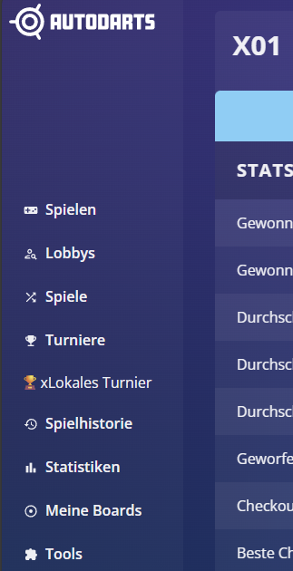

## Erste Orientierung in Autodarts
Nach Installation ist links im Hauptmenü der neue Eintrag sichtbar. Darüber öffnest du den Assistant mit den Tabs:
- `Turnier`
- `Spiele`
- `Turnierbaum`
- `Import/Export`
- `Einstellungen`

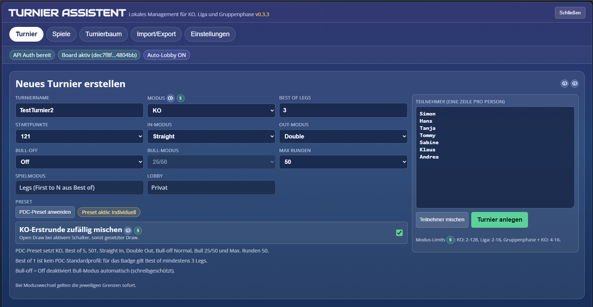

## Funktionen
- Turniermodi:
  - `ko`
  - `league`
  - `groups_ko`
- Ergebnisführung:
  - Manuelles Speichern pro Match
  - API-Matchstart per Klick
  - API-Sync für Ergebnisse
  - Inline-Button auf `/history/matches/{id}`:
    `Ergebnis aus Statistik übernehmen & Turnier öffnen`
- KO-Ansicht:
  - Bracket via `brackets-viewer` (primär)
  - HTML-Fallback bei CDN-Fehler/Timeout
- Turnieranlage:
  - KO-Erstrunde als Hybrid-Draw (`seeded` oder `open_draw`)
  - X01-Preset-Button für Matchanlage (PDC-Defaults + Custom-Status)
  - Kompaktes Formular-Layout (Konfiguration + Teilnehmerbereich)
  - Teilnehmerliste kann per Button gemischt werden
  - Formularentwurf bleibt erhalten (z. B. beim Moduswechsel)
- Import/Export:
  - JSON-Datei exportieren
  - JSON in die Zwischenablage kopieren
  - JSON per Datei oder Text importieren

## Turniermodi
| Modus | Beschreibung | Typischer Einsatz |
|---|---|---|
| `ko` | Klassischer Single-Elimination-Baum | Schnelles Turnier mit Finalrunde |
| `league` | Jeder gegen jeden (Round Robin) | Kleine Gruppe mit kompletter Tabelle |
| `groups_ko` | 2 Gruppen, danach KO-Phase | Kombination aus Gruppenphase und Finalrunde |

### KO (`ko`)
- Hybrid-Draw:
  - `KO-Erstrunde zufällig mischen = OFF` -> `seeded` (Eingabereihenfolge als Seed 1..n).
  - `KO-Erstrunde zufällig mischen = ON` -> `open_draw` (deterministisch gemischte Seed-Reihenfolge).
- Bye-Verteilung ist PDC/DRA-konform für gesetzte Draws:
  - Bei nicht voller 2er-Potenz erhalten Top-Seeds Freilose.
  - Beispiel mit 9 Spielern im 16er-Baum: Nur Seed 8 vs Seed 9 spielt in Runde 1.
- KO-Matches werden pro Turnierast freigeschaltet:
  - Ein Match ist spielbar, sobald beide Teilnehmer feststehen.
  - Bei Runde > 1 müssen die direkten Vorgänger-Matches abgeschlossen sein.
- Nur Runde-1-Byes dürfen automatisch als abgeschlossen gesetzt werden.
- Freilose werden im Tab `Spiele` explizit als `Freilos (Bye)` markiert.

### Liga (`league`)
- Vollständiger Round-Robin-Spielplan.
- Tabelle basiert auf:
  - Punkte
  - Direktvergleich (bei 2 Punktgleichen, DRA strict)
  - Teilgruppen-Leg-Differenz (bei 3+ Punktgleichen, DRA strict)
  - Leg-Differenz gesamt
  - Legs For gesamt
  - Bei weiterem Gleichstand: `Playoff erforderlich`

### Gruppenphase + KO (`groups_ko`)
- Zwei Gruppen (`A`, `B`).
- Top-2 jeder Gruppe qualifizieren sich für KO.
- Kreuz-Halbfinale:
  - `A1 vs B2`
  - `B1 vs A2`
- Das Finale folgt nach den Halbfinals.

## Turnier anlegen
Tab: `Turnier`


### Pflichtfelder
- Turniername
- Modus
- Teilnehmer (eine Zeile pro Person)

### Feld- und Auswahlinhalte (inkl. Warum)
| Feld | Optionen / Eingaben | Was es steuert | Warum das wichtig ist |
|---|---|---|---|
| `Turniername` | Freitext | Name für aktive Sitzung/Export | Erleichtert Zuordnung bei mehreren lokalen Events |
| `Modus` | `KO`, `Liga`, `Gruppenphase + KO` | Spielplanlogik, Tabellenlogik, KO-Pfade | Falscher Modus führt zu falscher Matchanzahl/Fortschrittslogik |
| `Best of Legs` | Ungerade `1..21` | Matchlänge; intern `First to N` | Definiert Siegbedingung pro Match und Turnierdauer |
| `Startpunkte` | `121`, `170`, `301`, `501`, `701`, `901` | X01-Basis für jedes Match | Beeinflusst Matchdauer und Schwierigkeitsprofil |
| `In-Modus` | `Straight`, `Double`, `Master` | Wie ein Leg gestartet wird | Regelt Einstiegsanforderung je Spielstil/Regelwerk |
| `Out-Modus` | `Straight`, `Double`, `Master` | Wie ein Leg beendet wird | Zentrale Regel für Checkout-Strenge |
| `Bull-off` | `Off`, `Normal`, `Official` | Startreihenfolge-/Bull-off-Verhalten für Lobby | Legt fest, wie Anstöße entschieden werden |
| `Bull-Modus` | `25/50`, `50/50` | Wertung der Bull-Segmente | Muss mit Hausregeln/Turnierkontext konsistent sein |
| `Max Runden` | `15`, `20`, `50`, `80` | Upper bound für Matchdauer in der Lobby | Verhindert hängende/zu lange Matches |
| `Spielmodus` | fix `Legs (First to N aus Best of)` | Nicht umstellbar in der UI | Verhindert inkonsistente Kombinationen im lokalen Flow |
| `Lobby` | fix `Privat` | Sichtbarkeit der API-Lobby | Lokales Turnier bleibt bewusst privat/sicher |
| `Preset` | Button `PDC-Preset anwenden` | Setzt PDC-konformes X01-Setup | Schnelles Setup ohne manuelle Einzelkonfiguration |
| `KO-Erstrunde zufällig mischen` | Checkbox `ON/OFF` | `open_draw` oder `seeded` in Runde 1 | Transparente Entscheidung zwischen Zufall und Setzlogik |
| `Teilnehmer` | Je Spieler eine Zeile | Teilnehmerliste inkl. Reihenfolge | Reihenfolge ist bei `seeded` zugleich Seed-Reihenfolge |
| `Teilnehmer mischen` | Button | Mischt Teilnehmertextliste | Praktisch für spontane Auslosung vor Start |

### PDC-Standard-Preset
- Bei Neuanlage ist standardmäßig `PDC Standard` aktiv.
- Das Preset wird per Button auf die Felder angewendet (kein Dropdown-Select).
- Das Preset setzt:
  - Turniermodus `KO`
  - `Best of Legs` auf `5`
  - Matchart `X01`
  - X01 `501`
  - `Straight In`
  - `Double Out`
  - Bull mode `25/50`
  - Bull-off `Normal`
  - Max Runden `50`
  - Lobby `Privat` (fix)
- Der Spielmodus bleibt `Legs`; `Best-of Legs` ist führend für die Matchlänge und wird API-seitig als `First to N Legs` umgesetzt.
- `Best of 1` gilt nicht als PDC-Standardprofil im Tool.
- Das PDC-Logo-Badge erscheint, wenn das Setup vollständig passt:
  - KO
  - Best of mindestens 3 Legs
  - 501 Straight In, Double Out, Bull 25/50, Bull-off Normal, Max Runden 50


### Verhalten beim Formular
- Das Eingabeformular speichert einen Entwurf.
- Dadurch bleiben Eingaben erhalten, auch wenn:
  - der Modus gewechselt wird
  - die UI neu gerendert wird
- Wenn `Bull-off = Off`, wird `Bull mode` automatisch read-only deaktiviert.
- Bei manuellen Änderungen an X01-Feldern springt der Preset-Status auf `Individuell`.

### Nach dem Anlegen
Im aktiven Turnier siehst du die wichtigsten Tags sofort:
- Format (`KO`, `Liga`, `Gruppenphase + KO`)
- `Best of`, `First to`, `Startpunkte`
- Bei KO: `Open Draw`/`Gesetzter Draw`, `Draw-Lock aktiv/aus`
- X01-Zusammenfassung und Teilnehmerchips

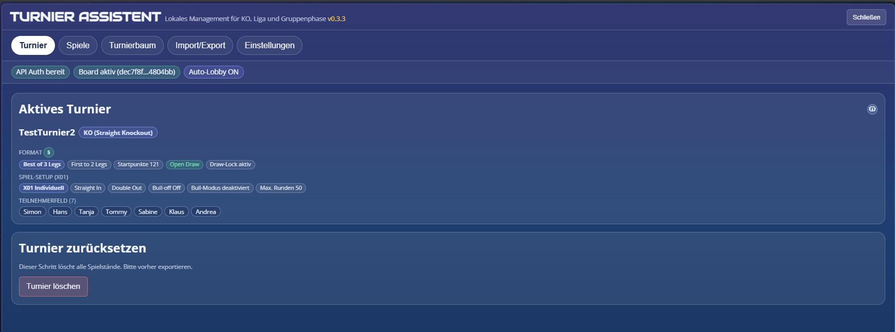

## API-Halbautomatik
Tab: `Spiele`

### Voraussetzungen
- Gültiger Autodarts-Login (Auth-Token)
- Aktives Board in Autodarts
- Feature-Flag `Automatischer Lobby-Start + API-Sync` aktiv

### Ablauf
1. Match in `Spiele` über `Match starten` auslösen.
2. Eine Lobby wird mit den Turnier-Settings erstellt (X01-Felder + Legs aus `Best of Legs`), immer als private Lobby.
3. Spieler werden hinzugefügt und das Match wird gestartet.
4. Ergebnis wird per API geholt und lokal gespeichert.
5. Auf der Statistikseite (`/history/matches/{id}`) steht zusätzlich ein direkter Import-Button zur Verfügung.

### Ergebnisführung: Sortierung und Status verstehen
Sortiersegmente im Tab `Spiele`:
- `Spielbar zuerst`: priorisiert live/spielbare Paarungen für schnellen Ablauf.
- `Runde/Spiel`: strikte Reihenfolge nach Turnierstruktur.
- `Status`: gruppiert nach offen/abgeschlossen/Freilos.

Wichtige Markierungen:
- `Nächstes Match`: empfohlene nächste Paarung (PDC: Next Match).
- `Freilos (Bye)`: automatischer Weiterzug ohne Spiel.
- `Finale`: letzte KO-Paarung.
- `Champion`: finaler Gewinner inklusive Leg-Ergebnis.

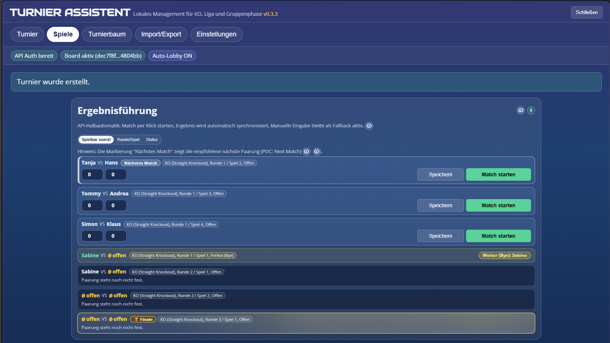

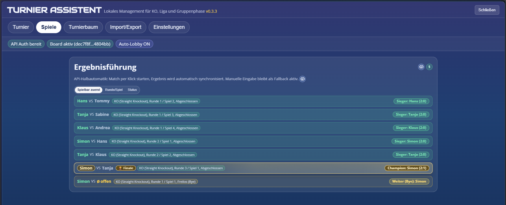

### Statistik-Import auf der Match-Historie
Auf `/history/matches/{id}` kann das Tool ein Ergebnis direkt aus der Statistik übernehmen:
- Button: `Ergebnis aus Statistik übernehmen & Turnier öffnen`
- Mit Statushinweis (`Import bereit`, letzter Sync-Status, Fehlerhinweis)
- Öffnet danach direkt den Assistant-Tab `Spiele`

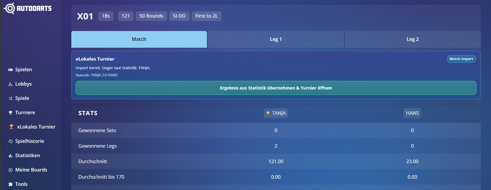

### Schutzmechanismen
- Nur ein aktives API-Match gleichzeitig (Single-Board-Flow).
- Duplikatnamen werden für API-Sync blockiert.
- Ungültige Ergebnisse werden abgewiesen.
- Bei mehrdeutigen Zuordnungen wird absichtlich nicht automatisch übernommen.

## Turnierbaum
Tab: `Turnierbaum`

- KO-Baum wird im iframe über `brackets-viewer` gerendert.
- Bei CDN-Problemen zeigt die App einen HTML-Fallback.
- Freilose, abgeschlossene Spiele und Finale sind visuell markiert.

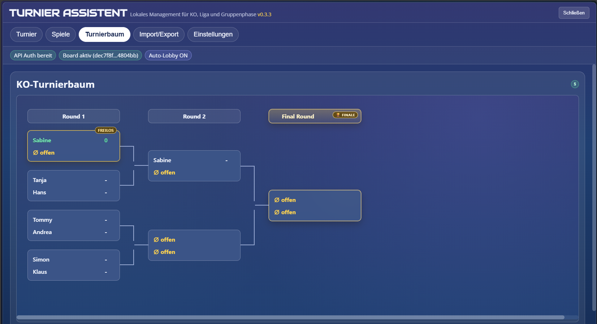
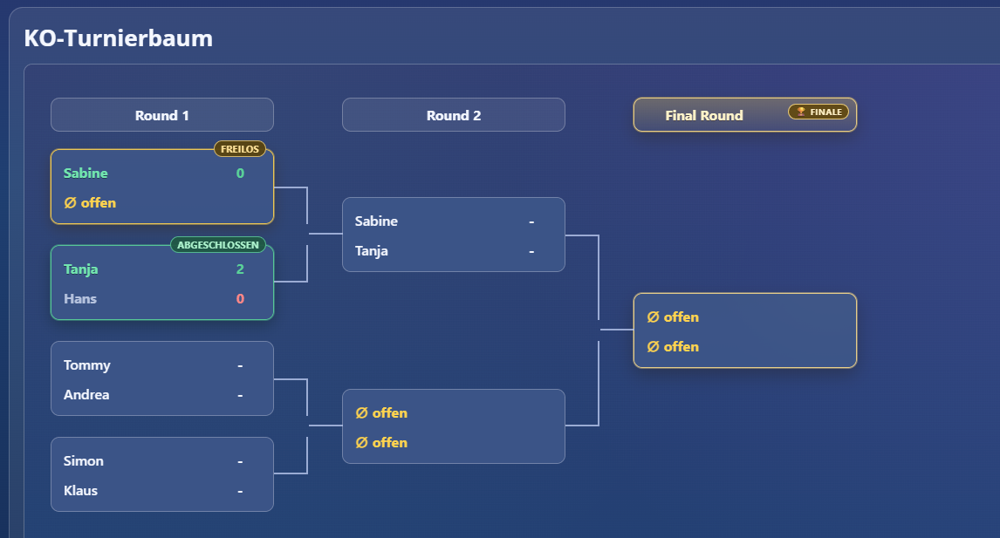
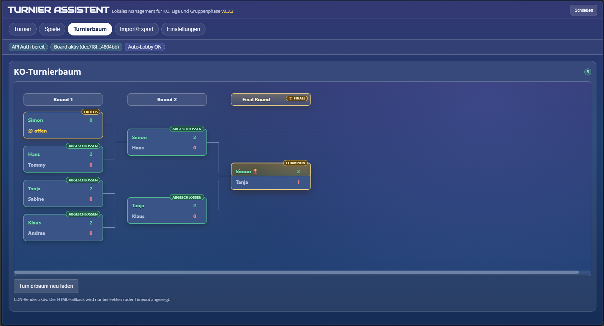

## Import und Export
Tab: `Import/Export`

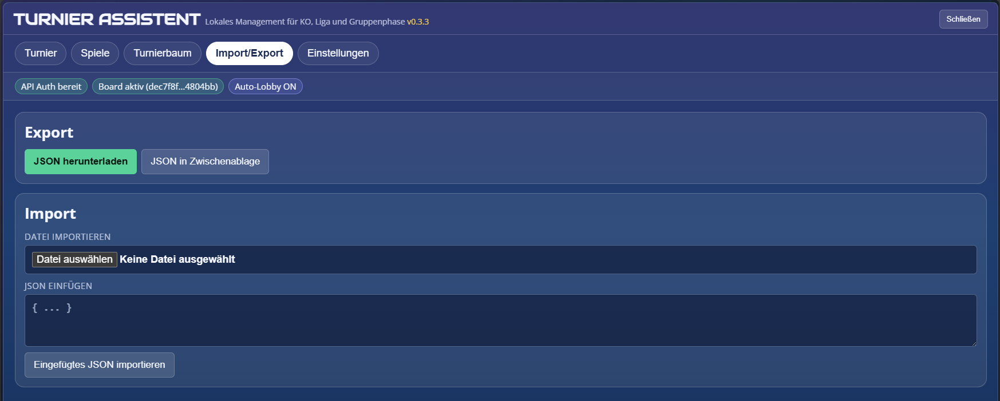

### Export
- `JSON herunterladen`
- `JSON in Zwischenablage`

### Import
- Dateiimport (`.json`)
- JSON-Text direkt einfügen

### Daten- und Migrationshinweise
- Persistenzschema: `schemaVersion: 4`
- Beim Import werden Daten defensiv normalisiert.
- Legacy-KO-Turniere werden auf KO-Engine v3 migriert.
- Vor KO-Migration wird ein Backup unter `ata:tournament:ko-migration-backups:v2` abgelegt.
- Bestehende Turniere werden auf
  `tournament.rules.tieBreakProfile = promoter_h2h_minitable` normalisiert.

## Einstellungen
Tab: `Einstellungen`

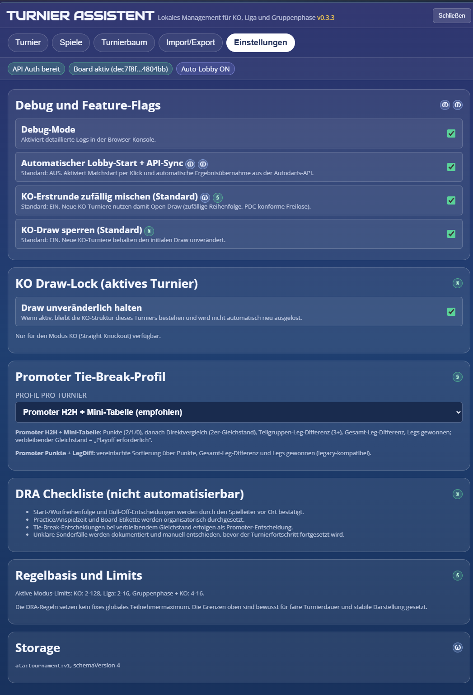

### Info-Symbole
Legende für die eingeblendeten Hilfelinks:

| Symbol | Bedeutung | Typischer Inhalt |
|---|---|---|
|  | `Info-Icon` = technische Information | Bedienung, Implementierung, README-Kontext |
|  | `Regel-Icon` = Regelwerk | DRA-Bezug, Kapitel/Punkt/Seite, Hintergründe |

- Das `Info-Icon` verweist auf Bedienung, Implementierung und interne Projektdokumentation.
- Das `Regel-Icon` verweist auf die zentrale Regelerklärung in [docs/dra-regeln-gui.md](docs/dra-regeln-gui.md).

### Debug-Mode
- Aktiviert ausführliche Logs in der Browser-Konsole.
- Prefix z. B. `[ATA][api]`, `[ATA][bracket]`, `[ATA][storage]`.
- Sinnvoll für Fehlersuche bei API oder Renderproblemen.

### Automatischer Lobby-Start + API-Sync
- Standard: `AUS`.
- Wenn aktiv:
  - `Match starten` erstellt Lobby, fügt Spieler hinzu, startet Match.
  - Ergebnis wird automatisch aus der API übernommen.
- Warum: weniger manuelle Schritte, geringeres Risiko für Übertragungsfehler.

### KO-Erstrunde zufällig mischen (Standard)
- Standard: `EIN`.
- Gilt für neu erstellte KO-Turniere.
- `EIN` -> `open_draw` (zufällige Reihenfolge in Runde 1).
- `AUS` -> `seeded` (Eingabereihenfolge als Seed-Rang).
- Warum: Turnierleitung kann zwischen offener Auslosung und Setzlogik wählen.

### KO Draw-Lock (Standard)
- Standard: `EIN`.
- Neue KO-Turniere übernehmen den Initial-Draw unverändert (`drawLocked = true`).
- Bezug: DRA `6.12.1` (veröffentlichter Draw bleibt bestehen).
- Im Tab `Einstellungen` kann das aktive KO-Turnier bei Bedarf explizit entsperrt werden.
- Warum: Verhindert unfaire oder versehentliche Nachauslosung während laufendem Turnier.

### Promoter Tie-Break-Profil
- `Promoter H2H + Mini-Tabelle` (empfohlen):
  - Punkte (`2` Sieg, `1` Unentschieden, `0` Niederlage)
  - Direktvergleich bei genau 2 Punktgleichen
  - Teilgruppen-Leg-Differenz bei 3+ Punktgleichen
  - danach Gesamt-Leg-Differenz und Legs gewonnen
  - bei weiterem Gleichstand: `Playoff erforderlich`
- `Promoter Punkte + LegDiff`:
  - vereinfachte, legacy-kompatible Sortierung
  - Reihenfolge: Punkte -> Gesamt-Leg-Differenz -> Legs gewonnen

Warum dieses Feld wichtig ist:
- DRA `6.16.1` erlaubt Tie-Breaks nach Ermessen des Veranstalters.
- Das Profil erzwingt eine klare, reproduzierbare Reihenfolge statt Ad-hoc-Entscheidung.

## Regelbasis und Limits
Priorisierung für Limits in diesem Projekt:
1. Offizielle Darts-Regeln
2. Mathematische Turnierlogik
3. Technische Machbarkeit im Userscript

### Offizielle Regelquellen
- DRA-Rulebook-Seite: https://www.thedra.co.uk/dra-rulebook
- DRA-Rulebook-PDF (Projektkopie): [docs/DRA-RULE_BOOK.pdf](docs/DRA-RULE_BOOK.pdf)
- DRA-Referenzen:
  - Definition Bye: Abschnitt `2` (Seite 4):
    [DRA-RULE_BOOK.pdf#page=4](docs/DRA-RULE_BOOK.pdf#page=4)
  - Turnierformat KO / Round Robin: `6.8.1`, `6.8.2` (Seite 17):
    [DRA-RULE_BOOK.pdf#page=17](docs/DRA-RULE_BOOK.pdf#page=17)
  - Teilnehmer und Veranstalter-Ermessen: `6.10.1`, `6.10.5.2` (Seiten 17-18):
    [DRA-RULE_BOOK.pdf#page=18](docs/DRA-RULE_BOOK.pdf#page=18)
  - Draw bleibt bestehen: `6.12.1` (Seite 18):
    [DRA-RULE_BOOK.pdf#page=18](docs/DRA-RULE_BOOK.pdf#page=18)
  - Tie-Break im Ermessen des Veranstalters: `6.16.1` (Seite 20):
    [DRA-RULE_BOOK.pdf#page=20](docs/DRA-RULE_BOOK.pdf#page=20)

### Umgesetzte Limits (mit Hintergrund)
| Modus | Limit | Warum |
|---|---|---|
| `ko` | `2..128` | Regelkonform ohne kleines Kunstlimit; 128 als technischer Stabilitätsdeckel für Bracket/UI. |
| `league` | `2..16` | Round Robin wächst quadratisch (`n*(n-1)/2`); oberhalb 16 wird Dauer und Bedienung für lokale Events schnell unpraktisch. |
| `groups_ko` | `4..16` | Mindestens 4 für zwei Gruppen mit anschliessender KO-Phase; Obergrenze aus Spielanzahl/Bedienbarkeit. |

Hinweise:
- Zusätzliches technisches Hard-Cap: `128` Teilnehmer.
- Die GUI verlinkt Regelhintergründe über das `Regel-Icon` auf [docs/dra-regeln-gui.md](docs/dra-regeln-gui.md).

### Warum diese Regeln für Spieler relevant sind
- **Transparenz:** Jeder sieht, warum ein Match gesperrt/freigeschaltet ist.
- **Fairness:** Draw-Lock und Bye-Handling verhindern spätere Strukturmanipulation.
- **Nachvollziehbarkeit:** Tie-Break-Profil macht Tabellenentscheidungen reproduzierbar.
- **Planbarkeit:** Limits schützen vor Turnierformaten, die lokal kaum sauber durchführbar sind.

## Troubleshooting
### "Match ist abgeschlossen", obwohl neu
- Ursache ist meist ein inkonsistenter Altzustand.
- Lösung:
  1. Seite neu laden.
  2. Falls nötig Turnier neu anlegen.
  3. Prüfen, ob `Freilos` in Runde 1 automatisch weitergeleitet wurde (das ist korrekt).

### "Board-ID ungültig (manual)"
- Einmal in Autodarts manuell eine Lobby öffnen und ein Board setzen.
- Danach Seite neu laden.

### API-Start/Sync funktioniert nicht
- Login prüfen (Token vorhanden?).
- Feature-Flag aktiv?
- Eindeutige Teilnehmernamen verwenden.
- Bei mehreren offenen Matches mit derselben Paarung wird absichtlich nicht automatisch übernommen (`Mehrdeutige Zuordnung`), um falsche Ergebnisse zu vermeiden.

### Bracket wird nicht gerendert
- CDN kann temporär nicht erreichbar sein.
- Der HTML-Fallback wird dann angezeigt.

## Entwicklung
### Repo-Struktur
```text
autodarts_local_tournament/
|- src/
|  |- core/
|  |- data/
|  |- domain/
|  |- infra/
|  |- ui/
|  |  |- styles/
|  |- bracket/
|  |- runtime/
|- build/
|  |- manifest.json
|- scripts/
|  |- build.ps1
|  |- qa.ps1
|  |- qa-encoding.ps1
|  |- qa-regelcheck.ps1
|- tests/
|  |- fixtures/
|  |- selftest-runtime.js
|- installer/
|  |- Autodarts Tournament Assistant Loader.user.js
|- dist/
|  |- autodarts-tournament-assistant.user.js
|- docs/
|  |- architecture.md
|  |- pdc-dra-compliance.md
|  |- refactor-guide.md
|  |- selector-strategy.md
|  |- changelog.md
|- assets/
|- README.md
|- LICENSE
```

### Hauptdateien
- Quellcode: `src/*`
- Build-Metadaten: `build/manifest.json`
- Build/QA: `scripts/*.ps1`
- Runtime-Script: `dist/autodarts-tournament-assistant.user.js`
- Loader-Script: `installer/Autodarts Tournament Assistant Loader.user.js`

### Build und QA
```powershell
powershell -ExecutionPolicy Bypass -File scripts/build.ps1
powershell -ExecutionPolicy Bypass -File scripts/qa.ps1
```

### Architektur
- Shadow DOM für gekapselte UI
- SPA-Routing-Hooks für stabile Einbindung in Autodarts
- Defensive Persistenz-Normalisierung
- Bracket-Rendering in sandboxed iframe

## Limitationen
- Modus-Limits:
  - `ko`: `2..128`
  - `league`: `2..16`
  - `groups_ko`: `4..16`
- Technisches Hard-Cap: `128` Teilnehmer
- API-Halbautomatik basiert auf in der Praxis verwendeten Endpunkten (Inference)
- DOM-Autodetect bleibt best-effort

## Quellen
- DRA (offizielle Regelbasis):
  - https://www.thedra.co.uk/dra-rulebook
  - [docs/DRA-RULE_BOOK.pdf](docs/DRA-RULE_BOOK.pdf)
- PDC (Open Draw Kontext, Eventregeln):
  - https://www.pdc.tv/news/2013/01/16/rules-challenge-youth-tours
- JS-Modularisierung:
  - https://developer.mozilla.org/en-US/docs/Web/JavaScript/Guide/Modules
- Tampermonkey Dokumentation:
  - https://www.tampermonkey.net/documentation.php?locale=en
- Tampermonkey FAQ (Injection):
  - https://www.tampermonkey.net/faq.php#Q209
- Referenz-Extension:
  - https://chromewebstore.google.com/detail/autodarts-local-tournamen/algfbicoennnolleogigbefngpkkmcng
- Bracket Viewer:
  - https://github.com/Drarig29/brackets-viewer.js
- Autodarts Themes/Pattern Inspiration:
  - https://github.com/thomasasen/autodarts-tampermonkey-themes
