# Autodarts Tournament Assistant

Lokales Turniermanagement direkt in `https://play.autodarts.io` als Userscript.

[](https://raw.githubusercontent.com/thomasasen/autodarts_local_tournament/main/installer/Autodarts%20Tournament%20Assistant%20Loader.user.js)

Der Assistent erweitert die Autodarts-Oberfläche um einen eigenen Bereich für:
- Turnieranlage (KO, Liga, Gruppenphase + KO)
- Ergebnisführung
- Turnieransicht (Tabelle + Bracket)
- Import/Export
- API-Halbautomatik (Start per Klick + Ergebnis-Sync)

## Inhalt
1. [Dokumentation](#dokumentation)
2. [Installation](#installation)
3. [Erste Orientierung in Autodarts](#erste-orientierung-in-autodarts)
4. [Funktionen](#funktionen)
5. [Turniermodi](#turniermodi)
6. [Turnier anlegen](#turnier-anlegen)
7. [API-Halbautomatik](#api-halbautomatik)
8. [Statusmeldungen](#statusmeldungen)
9. [Turnierbaum](#turnierbaum)
10. [Import und Export](#import-und-export)
11. [Einstellungen](#einstellungen)
12. [Regelbasis und Limits](#regelbasis-und-limits)
13. [Troubleshooting](#troubleshooting)
14. [Entwicklung](#entwicklung)
15. [Limitationen](#limitationen)
16. [Quellen](#quellen)

## Dokumentation
Zusätzliche Detaildoku zur Zeitberechnung: [docs/tournament-duration.md](docs/tournament-duration.md)
| Dokument | Inhalt | Für wen |
|---|---|---|
| [docs/codebase-map.md](docs/codebase-map.md) | Vollständige technische Codebasis-Karte mit Ordnerlogik, Dateirollen, Build-/Runtime-Fluss und Diagrammen | Entwickler / Maintainer |
| [docs/architecture.md](docs/architecture.md) | Kompakter Überblick über Schichten, Persistenz, KO-Logik, Runtime und Qualitätsbausteine | Entwickler / technischer Überblick |
| [docs/refactor-guide.md](docs/refactor-guide.md) | Änderungsregeln, Modulgrenzen und empfohlener Build-/QA-Ablauf | Entwickler bei Änderungen |
| [docs/selector-strategy.md](docs/selector-strategy.md) | DOM-/Selector-Strategie für die automatische Ergebnisübernahme | Entwickler für Autodetect/API-Debugging |
| [docs/pdc-dra-compliance.md](docs/pdc-dra-compliance.md) | Überblick, welche PDC/DRA-Regelpunkte fachlich umgesetzt sind | Turnierlogik / Regelbezug |
| [docs/dra-compliance-matrix.md](docs/dra-compliance-matrix.md) | Detailmatrix zu Regel-Mappings, Tie-Break-Profilen und Migration | Entwickler / Regel-Review |
| [docs/dra-regeln-gui.md](docs/dra-regeln-gui.md) | GUI-bezogene Regelerklärungen für Info-/Regel-Links in der Oberfläche | Nutzer / Turnierleitung / Entwickler |
| [docs/autodarts-api-capabilities.md](docs/autodarts-api-capabilities.md) | Beobachtete API-Endpunkte, Risikoklassen und Probe-Vorgehen zur laufenden Erweiterung | Entwickler / API-Integration |
| [docs/changelog.md](docs/changelog.md) | Historie der Releases und Funktionsänderungen | Nutzer / Entwickler |

## Installation
1. Tampermonkey installieren: [tampermonkey.net](https://www.tampermonkey.net/)
2. Oben auf `Installieren` klicken.
3. Die Installation in Tampermonkey bestätigen.
4. `https://play.autodarts.io` neu laden.
5. Links im Menü **xLokales Turnier** öffnen.

Empfohlen ist die Installation über den Loader:

[](https://raw.githubusercontent.com/thomasasen/autodarts_local_tournament/main/installer/Autodarts%20Tournament%20Assistant%20Loader.user.js)

Alternative ohne Loader:
- Direktes Runtime-Skript: [autodarts-tournament-assistant.user.js](https://raw.githubusercontent.com/thomasasen/autodarts_local_tournament/main/dist/autodarts-tournament-assistant.user.js)

Wichtiger Hinweis nach der Installation:
- Bei Loader-Installation reicht für Updates ein Reload von `play.autodarts.io`.
- Bei direkter Runtime-Installation erscheint im Tab `Einstellungen` eine GitHub-Update-Prüfung mit `Update installieren`.
- Falls Tampermonkey nicht in `play.autodarts.io` injiziert, siehe [Tampermonkey FAQ](https://www.tampermonkey.net/faq.php#Q209).

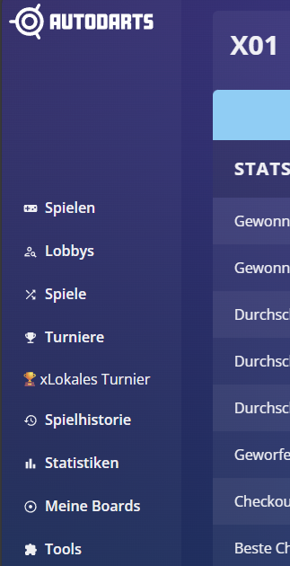

## Erste Orientierung in Autodarts
Nach Installation ist links im Hauptmenü der neue Eintrag sichtbar. Darüber öffnest du den Assistant mit den Tabs:
- `Turnier`
- `Spiele`
- `Turnierbaum`
- `Import/Export`
- `Einstellungen`

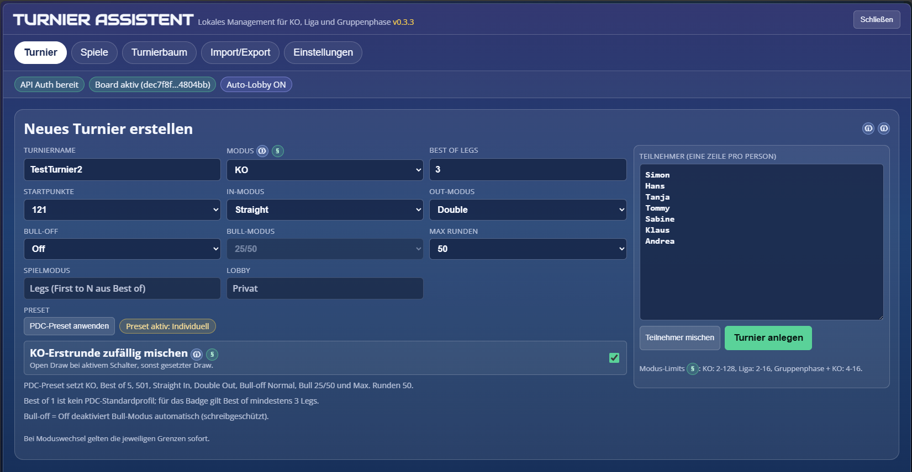

## Funktionen
- Turniermodi:
  - `ko`
  - `league`
  - `groups_ko`
- Ergebnisführung:
  - Manuelles Speichern pro Match
  - API-Matchstart per Klick
  - API-Sync für Ergebnisse
  - Inline-Button auf `/history/matches/{id}`:
    `Ergebnis aus Statistik übernehmen & Turnier öffnen`
- KO-Ansicht:
  - Bracket via `brackets-viewer` (primär)
  - HTML-Fallback bei CDN-Fehler/Timeout
- Turnieranlage:
  - KO-Erstrunde als Hybrid-Draw (`seeded` oder `open_draw`)
  - Preset-Auswahl mit offiziellem European-Tour-Format, Basic-Kompatibilitätsprofil und Custom-Status
  - Kompaktes Formular-Layout (Konfiguration + Teilnehmerbereich)
  - Live-Prognose für die voraussichtliche Turnierzeit
  - Teilnehmerliste kann per Button gemischt werden
  - Formularentwurf bleibt erhalten (z. B. beim Moduswechsel)
- Import/Export:
  - JSON-Datei exportieren
  - JSON in die Zwischenablage kopieren
  - JSON per Datei oder Text importieren

## Turniermodi
| Modus | Beschreibung | Typischer Einsatz |
|---|---|---|
| `ko` | Klassischer Single-Elimination-Baum | Schnelles Turnier mit Finalrunde |
| `league` | Jeder gegen jeden (Round Robin) | Kleine Gruppe mit kompletter Tabelle |
| `groups_ko` | 2 Gruppen, danach KO-Phase | Kombination aus Gruppenphase und Finalrunde |

### KO (`ko`)
- Hybrid-Draw:
  - `KO-Erstrunde zufällig mischen = OFF` -> `seeded` (Eingabereihenfolge als Seed 1..n).
  - `KO-Erstrunde zufällig mischen = ON` -> `open_draw` (deterministisch gemischte Seed-Reihenfolge).
- Bye-Verteilung ist PDC/DRA-konform für gesetzte Draws:
  - Bei nicht voller 2er-Potenz erhalten Top-Seeds Freilose.
  - Beispiel mit 9 Spielern im 16er-Baum: Nur Seed 8 vs Seed 9 spielt in Runde 1.
- KO-Matches werden pro Turnierast freigeschaltet:
  - Ein Match ist spielbar, sobald beide Teilnehmer feststehen.
  - Bei Runde > 1 müssen die direkten Vorgänger-Matches abgeschlossen sein.
- Nur Runde-1-Byes dürfen automatisch als abgeschlossen gesetzt werden.
- Freilose werden im Tab `Spiele` explizit als `Freilos (Bye)` markiert.

### Liga (`league`)
- Vollständiger Round-Robin-Spielplan.
- Tabelle basiert auf:
  - Punkte
  - Direktvergleich (bei 2 Punktgleichen, DRA strict)
  - Teilgruppen-Leg-Differenz (bei 3+ Punktgleichen, DRA strict)
  - Leg-Differenz gesamt
  - Legs For gesamt
  - Bei weiterem Gleichstand: `Playoff erforderlich`

### Gruppenphase + KO (`groups_ko`)
- Zwei Gruppen (`A`, `B`).
- Top-2 jeder Gruppe qualifizieren sich für KO.
- Kreuz-Halbfinale:
  - `A1 vs B2`
  - `B1 vs A2`
- Das Finale folgt nach den Halbfinals.

## Turnier anlegen
Tab: `Turnier`


### Pflichtfelder
- Turniername
- Modus
- Teilnehmer (eine Zeile pro Person)

### Feld- und Auswahlinhalte (inkl. Warum)
| Feld | Optionen / Eingaben | Was es steuert | Warum das wichtig ist |
|---|---|---|---|
| `Turniername` | Freitext | Name für aktive Sitzung/Export | Erleichtert Zuordnung bei mehreren lokalen Events |
| `Modus` | `KO`, `Liga`, `Gruppenphase + KO` | Spielplanlogik, Tabellenlogik, KO-Pfade | Falscher Modus führt zu falscher Matchanzahl/Fortschrittslogik |
| `Best of Legs` | Ungerade `1..21` | Matchlänge; intern `First to N` | Definiert Siegbedingung pro Match und Turnierdauer |
| `Startpunkte` | `121`, `170`, `301`, `501`, `701`, `901` | X01-Basis für jedes Match | Beeinflusst Matchdauer und Schwierigkeitsprofil |
| `In-Modus` | `Straight`, `Double`, `Master` | Wie ein Leg gestartet wird | Regelt Einstiegsanforderung je Spielstil/Regelwerk |
| `Out-Modus` | `Straight`, `Double`, `Master` | Wie ein Leg beendet wird | Zentrale Regel für Checkout-Strenge |
| `Bull-off` | `Off`, `Normal`, `Official` | Startreihenfolge-/Bull-off-Verhalten für Lobby | Legt fest, wie Anstöße entschieden werden |
| `Bull-Modus` | `25/50`, `50/50` | Wertung der Bull-Segmente | Muss mit Hausregeln/Turnierkontext konsistent sein |
| `Max Runden` | `15`, `20`, `50`, `80` | Upper bound für Matchdauer in der Lobby | Verhindert hängende/zu lange Matches |
| `Spielmodus` | fix `Legs (First to N aus Best of)` | Nicht umstellbar in der UI | Verhindert inkonsistente Kombinationen im lokalen Flow |
| `Lobby` | fix `Privat` | Sichtbarkeit der API-Lobby | Lokales Turnier bleibt bewusst privat/sicher |
| `Preset` | Auswahlfeld + Button `Preset anwenden` | Setzt alle Preset-relevanten Turnierfelder konsistent | Offizielle und kompatible Profile bleiben klar getrennt |
| `KO-Erstrunde zufällig mischen` | Checkbox `ON/OFF` | `open_draw` oder `seeded` in Runde 1 | Transparente Entscheidung zwischen deterministischer Open-Draw-Reihenfolge und Setzlogik |
| `Teilnehmer` | Je Spieler eine Zeile | Teilnehmerliste inkl. Reihenfolge | Reihenfolge ist bei `seeded` zugleich Seed-Reihenfolge |
| `Teilnehmer mischen` | Button | Mischt Teilnehmertextliste | Praktisch für spontane Auslosung vor Start |

### Preset-Katalog
- Bei Neuanlage ist standardmäßig `PDC European Tour (Official)` aktiv.
- Das Preset wird über Auswahlfeld + Button `Preset anwenden` auf alle relevanten Turnierfelder angewendet.
- Der Spielmodus bleibt immer `Legs`; `Best-of Legs` ist führend für die Matchlänge und wird API-seitig als `First to N Legs` umgesetzt.

| Preset | Parameter | Hinweise |
|---|---|---|
| `PDC European Tour (Official)` | `KO`, `Best of 11`, `501`, `Straight In`, `Double Out`, `Bull 25/50`, `Bull-off Normal`, `Max Runden 50`, `Lobby privat` | Offizielles Default-Rundenformat. `Bull-off Normal` und `Max Runden 50` sind AutoDarts-/Technikwerte; `Max Runden` ist **keine** PDC-Fachregel. |
| `PDC 501 / Double Out (Basic)` | `KO`, `Best of 5`, `501`, `Straight In`, `Double Out`, `Bull 25/50`, `Bull-off Normal`, `Max Runden 50`, `Lobby privat` | Ehrlich benanntes Kompatibilitätsprofil für das frühere irreführende `PDC Standard`. **Kein** offizielles PDC-Eventformat. |
| `Individuell / Manuell` | aktuelle Formularwerte | Status nach manuellen Änderungen an Preset-Feldern. |

### Nicht enthaltene PDC-Formate
- `PDC World Championship` wird bewusst **nicht** als offizielles Preset ausgeliefert.
- Grund:
  - Das Format arbeitet mit `Sets` (Best of Sets; ein Set besteht aus `Best of 5 Legs`).
  - Die AutoDarts-/ATA-Integration kann hier nur `Legs / First to N` abbilden.
- Deshalb behauptet die App an dieser Stelle **kein** echtes WM-Format.

### Verhalten beim Formular
- Das Eingabeformular speichert einen Entwurf.
- Dadurch bleiben Eingaben erhalten, auch wenn:
  - der Modus gewechselt wird
  - die UI neu gerendert wird
- Wenn `Bull-off = Off`, wird `Bull mode` automatisch read-only deaktiviert.
- Bei manuellen Änderungen an Preset-relevanten Feldern springt der Preset-Status auf `Individuell`.
- Legacy-Drafts und Legacy-Turniere mit der alten Preset-ID `pdc_standard` werden automatisch auf `PDC 501 / Double Out (Basic)` abgebildet, damit gespeicherte `Best of 5`-Turniere nicht still auf `Best of 11` umspringen.

### Voraussichtliche Turnierzeit
- Details zur Formel, zu den Faktoren und zur Benchmark-Basis: [docs/tournament-duration.md](docs/tournament-duration.md)
- In der rechten Spalte unter `Teilnehmer` wird eine Live-Prognose angezeigt.
- Die Berechnung aktualisiert sich bei jeder Änderung im Formular:
  - Teilnehmerzahl und Modus
  - `Best of Legs`
  - `Startpunkte`
  - `In-Modus`, `Out-Modus`
  - `Bull-off`, `Bull-Modus`
  - `Max Runden`
- Die Schätzung zeigt:
  - Hauptwert `ca. Xh Ym`
  - realistische Spannweite
  - Anzahl geplanter Spiele
  - durchschnittliche Matchdauer
- Annahme:
  - Single-Board-Flow auf einem Board
- Die globale Kalibrierung erfolgt über das Zeitprofil im Tab `Einstellungen`.

Beispiel der Live-Zeitprognose im Turnierformular:

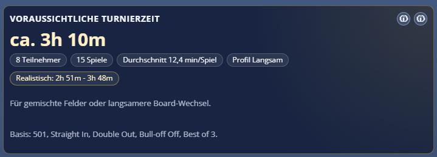

Die Anzeige bündelt Teilnehmerzahl, geplante Spielanzahl, durchschnittliche Matchdauer, aktives Zeitprofil und eine realistische Spannweite in einem kompakten Überblick.

### Nach dem Anlegen
Im aktiven Turnier siehst du die wichtigsten Tags sofort:
- Format (`KO`, `Liga`, `Gruppenphase + KO`)
- `Best of`, `First to`, `Startpunkte`
- Bei KO: `Open Draw`/`Gesetzter Draw`, `Draw-Lock aktiv/aus`
- X01-Zusammenfassung und Teilnehmerchips

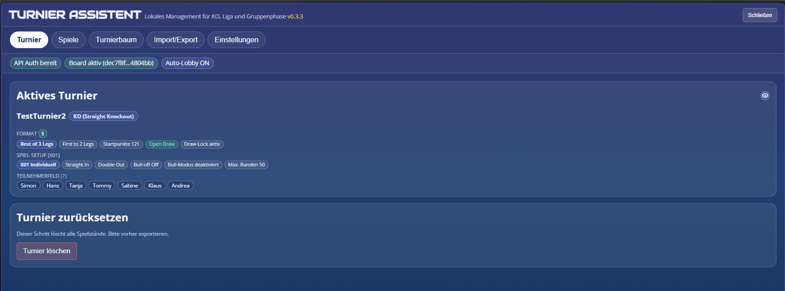

## API-Halbautomatik
Tab: `Spiele`

### Voraussetzungen
- Gültiger Autodarts-Login (Auth-Token)
- Aktives Board in Autodarts
- Feature-Flag `Automatischer Lobby-Start + API-Sync` aktiv

Das Auth-Token kann aus `Authorization`-Cookie, `autodarts_refresh_token` (Refresh-Flow) oder aus laufenden `api.autodarts.io`-Request-Headern im Runtime-Kontext stammen.
Eine laufend gepflegte Endpoint-Matrix steht in [docs/autodarts-api-capabilities.md](docs/autodarts-api-capabilities.md).

### Ablauf
1. Match in `Spiele` über `Match starten` auslösen.
2. Eine Lobby wird mit den Turnier-Settings erstellt (X01-Felder + Legs aus `Best of Legs`), immer als private Lobby.
3. Spieler werden hinzugefügt und das Match wird gestartet.
4. Ergebnis wird per API geholt und lokal gespeichert.
5. Auf der Statistikseite (`/history/matches/{id}`) steht zusätzlich ein direkter Import-Button zur Verfügung.

### Ergebnisführung: Sortierung und Status verstehen
Sortiersegmente im Tab `Spiele`:
- `Spielbar zuerst`: priorisiert live/spielbare Paarungen für schnellen Ablauf.
- `Runde/Spiel`: strikte Reihenfolge nach Turnierstruktur.
- `Status`: gruppiert nach offen/abgeschlossen/Freilos.

Die bekannten Statusmeldungen in Runtime-Leiste, Matchkarten, History-Import und passenden Notice-Bannern sind direkt klickbar und verweisen auf die jeweilige Stelle in dieser README.

Wichtige Markierungen:
- `Nächstes Match`: empfohlene nächste Paarung (PDC: Next Match).
- `Freilos (Bye)`: automatischer Weiterzug ohne Spiel.
- `Finale`: letzte KO-Paarung.
- `Champion`: finaler Gewinner inklusive Leg-Ergebnis.

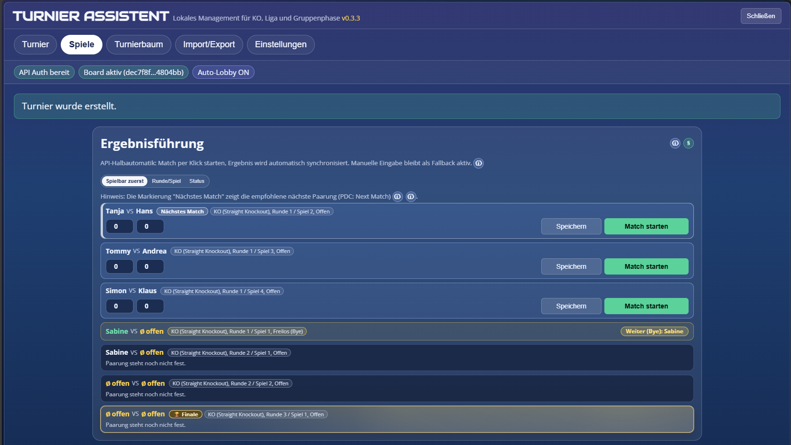
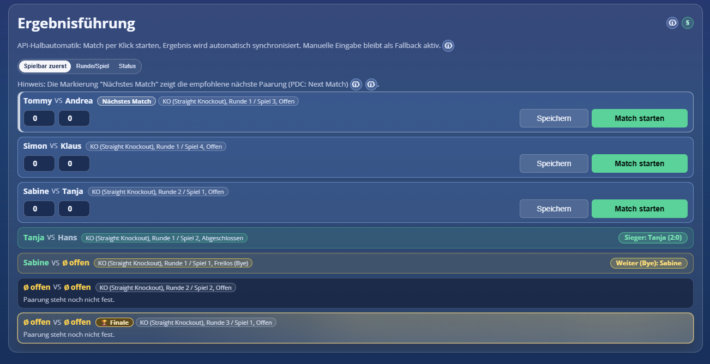
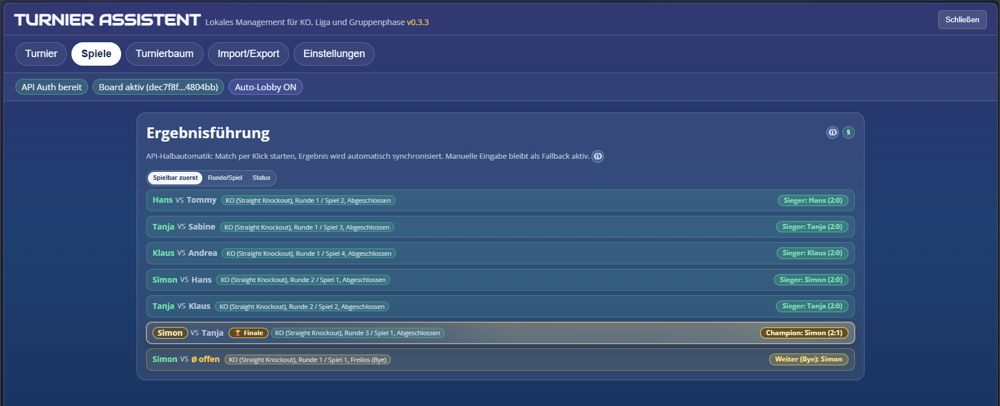

### Statistik-Import auf der Match-Historie
Auf `/history/matches/{id}` kann das Tool ein Ergebnis direkt aus der Statistik übernehmen:
- Button: `Ergebnis aus Statistik übernehmen & Turnier öffnen`
- Bei Legs-Abweichung vom Turniermodus ist eine explizite Bestätigung erforderlich (`requires_confirmation`).
- Mit Statushinweis (`Import bereit`, `Bestätigung erforderlich`, letzter Sync-Status, Fehlerhinweis)
- Öffnet danach direkt den Assistant-Tab `Spiele`

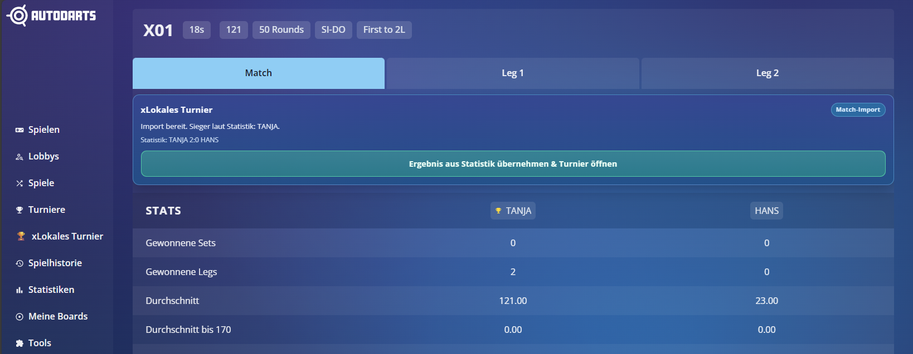

### Schutzmechanismen
- Nur ein aktives API-Match gleichzeitig (Single-Board-Flow).
- Duplikatnamen werden für API-Sync blockiert.
- Ungültige Ergebnisse werden abgewiesen.
- Wenn ein Matchstart vor dem eigentlichen `start` scheitert, wird eine bereits erstellte, aber noch ungestartete Lobby vorsichtig gelöscht.
- Bei mehrdeutigen Zuordnungen wird absichtlich nicht automatisch übernommen.

## Statusmeldungen
Diese Referenz deckt die aktuell implementierten klickbaren Statusmeldungen rund um API-Halbautomatik, Matchfreigabe und Statistik-Import ab. Wenn dieselbe Formulierung als kurzes Notice-Banner erscheint, verweist sie auf denselben Abschnitt.

### Runtime-Statusleiste
| Meldung | Bedeutung | Typische Aktion |
|---|---|---|
| <span id="statusmeldung-api-auth-fehlt"></span>`API Auth fehlt` / `Kein Auth-Token gefunden. Bitte neu einloggen.` | Im aktuellen Browser-Kontext wurde kein nutzbares Autodarts-Auth-Token gefunden. Die API-Halbautomatik kann so keine Lobby erstellen oder Ergebnisse lesen. | In `play.autodarts.io` neu einloggen, Seite einmal komplett neu laden und prüfen, ob Tampermonkey auf derselben Seite aktiv ist. Falls weiterhin fehlend: kurz in `Lobbies`/`Matches` navigieren, damit vorhandene Runtime-API-Header per Page-Bridge erkannt werden können. |
| <span id="statusmeldung-api-auth-abgelaufen"></span>`API Auth abgelaufen` / `Auth abgelaufen. Bitte neu einloggen.` | Es gab zwar bereits Auth-Daten, aber die API lehnt sie aktuell ab (`401/403`). | Neu einloggen und die Seite neu laden. Danach sollte der Status wieder auf `API Auth bereit` wechseln. |
| <span id="statusmeldung-api-auth-bereit"></span>`API Auth bereit` | Ein Auth-Token ist vorhanden und aktuell nicht durch den Backoff blockiert. | Keine Aktion nötig. Die API-Voraussetzung ist erfüllt. |
| <span id="statusmeldung-board-aktiv"></span>`Board aktiv (<id>)` | Es wurde eine gültige Board-ID im lokalen Autodarts-Kontext erkannt. | Keine Aktion nötig. Das Board kann für automatische Lobby-Erstellung verwendet werden. |
| <span id="statusmeldung-board-id-ungueltig"></span>`Board-ID ungültig (<id>)` | Es wurde zwar ein Board-Wert gefunden, aber er sieht nicht wie eine echte Board-ID aus, z. B. `manual` oder ein defekter Storage-Wert. | In Autodarts einmal manuell eine Lobby öffnen, ein echtes Board auswählen und danach die Seite neu laden. |
| <span id="statusmeldung-kein-aktives-board"></span>`Kein aktives Board` / `Board-ID fehlt. Bitte einmal manuell eine Lobby öffnen und Board auswählen.` | Für den aktuellen Browser wurde noch kein verwendbares Board hinterlegt. Ohne Board kann keine API-Lobby gestartet werden. | Manuell eine Lobby öffnen, Board auswählen, dann zurück zum Assistenten. |
| <span id="statusmeldung-auto-lobby-on"></span>`Auto-Lobby ON` | Das Feature-Flag für automatischen Lobby-Start und API-Sync ist aktiv. | Keine Aktion nötig. |
| <span id="statusmeldung-auto-lobby-off"></span>`Auto-Lobby OFF` / `Auto-Lobby ist deaktiviert.` | Die Halbautomatik ist global deaktiviert. Manuelle Ergebniseingabe bleibt möglich. | Im Tab `Einstellungen` `Automatischer Lobby-Start + API-Sync` aktivieren, wenn die Halbautomatik gewünscht ist. |
| <span id="statusmeldung-runtime-hinweis-api-voraussetzungen"></span>`Hinweis: Für API-Halbautomatik werden Auth-Token und aktives Board benötigt.` | Erinnerungs-Hinweis, dass für die Halbautomatik beide Voraussetzungen gleichzeitig erfüllt sein müssen. | Auth-Status und Board-Status in derselben Leiste prüfen. |

### Matchkarten und API-Sync
| Meldung | Bedeutung | Typische Aktion |
|---|---|---|
| <span id="statusmeldung-freilos-bye-kein-api-sync-erforderlich"></span>`Freilos (Bye): kein API-Sync erforderlich` | Das Match ist ein regelkonformes Freilos und braucht keine Lobby und keinen Sync. | Keine Aktion nötig. |
| <span id="statusmeldung-api-sync-abgeschlossen"></span>`API-Sync: abgeschlossen` | Das Match wurde automatisch mit API-/Import-Daten abgeschlossen. | Keine Aktion nötig. |
| <span id="statusmeldung-api-sync-aktiv"></span>`API-Sync: aktiv (Lobby <id>)` | Dieses Match ist mit einer laufenden Lobby verknüpft und wird zyklisch synchronisiert. | Match normal in Autodarts zu Ende spielen oder die Lobby über die verlinkte ID öffnen. |
| <span id="statusmeldung-api-sync-fehler"></span>`API-Sync: Fehler (<text>)` / `Auto-Sync Fehler bei <matchId>: <text>` / `Matchstart fehlgeschlagen: <text>` | Die API-Halbautomatik konnte einen Start- oder Sync-Schritt nicht sauber abschließen. Der Detailtext nennt den letzten bekannten Fehler. | Detailtext lesen, häufige Ursachen sind Auth, Board, mehrdeutige Zuordnung oder ungültige Ergebnisdaten. Manuelle Eingabe bleibt als Fallback möglich. |
| <span id="statusmeldung-api-sync-nicht-gestartet"></span>`API-Sync: nicht gestartet` | Für dieses Match wurde noch keine Lobby gestartet oder verknüpft. | Entweder `Match starten` nutzen oder das Ergebnis manuell speichern. |
| <span id="statusmeldung-match-nicht-verfuegbar"></span>`Match nicht verfügbar.` | Das Matchobjekt fehlt oder ist im aktuellen Zustand nicht bearbeitbar. | Turnierzustand neu laden; bei persistenter Abweichung Export prüfen oder Turnier neu erzeugen. |
| <span id="statusmeldung-match-bereits-abgeschlossen"></span>`Match ist bereits abgeschlossen.` | Das Ergebnis wurde schon gespeichert. | Keine erneute Eingabe nötig; ggf. im Turnierbaum oder in der Ergebnisliste prüfen. |
| <span id="statusmeldung-paarung-steht-noch-nicht-fest"></span>`Paarung steht noch nicht fest.` | Mindestens ein Teilnehmer des Matches ist noch offen, z. B. in späteren KO-Runden. | Zuerst die vorgelagerten Matches abschließen. |
| <span id="statusmeldung-vorgaenger-match-muss-zuerst-abgeschlossen-werden"></span>`Vorgänger-Match Runde <r> / Spiel <n> muss zuerst abgeschlossen werden.` | Das Match ist fachlich gesperrt, weil die direkte Vorpaarung noch offen ist. | Zuerst das genannte Vorgänger-Match abschließen. |
| <span id="statusmeldung-api-ergebnis-noch-nicht-final-verfuegbar"></span>`API-Ergebnis ist noch nicht final verfügbar.` / `Match-Stats noch nicht verfügbar.` | Die Lobby existiert, aber die API liefert noch kein belastbares Endergebnis. Das ist während eines laufenden Matches normal. | Kurz warten und erneut synchronisieren; kein Fehlerzustand. |
| <span id="statusmeldung-keine-lobby-id-erkannt"></span>`Keine Lobby-ID erkannt.` / `Keine Lobby-ID vorhanden.` | Für die angeforderte Aktion gibt es noch keine verknüpfte Lobby-ID. | Match zuerst starten oder auf der passenden Match-/History-Seite aufrufen. |
| <span id="statusmeldung-mehrdeutige-zuordnung-lobby"></span>`Mehrdeutige Zuordnung: mehrere offene Turnier-Matches passen zur Lobby. Bitte in der Ergebnisführung manuell speichern.` | Die API-Daten reichen nicht aus, um genau ein offenes Turniermatch sicher zu treffen. Automatik stoppt absichtlich. | Ergebnis manuell im korrekten Match speichern oder die Zuordnung über History/Teilnehmer klären. |
| <span id="statusmeldung-kein-offenes-turnier-match-fuer-diese-lobby-gefunden"></span>`Kein offenes Turnier-Match für diese Lobby gefunden.` | Es gibt keine noch offene Paarung, die zu dieser Lobby passt. | Prüfen, ob das Ergebnis bereits gespeichert wurde oder ob die Lobby zu einem anderen Match gehört. |
| <span id="statusmeldung-ergebnis-bereits-im-turnier-gespeichert"></span>`Ergebnis bereits im Turnier gespeichert.` / `Ergebnis war bereits übernommen.` | Das Ergebnis wurde schon einmal erfolgreich ins lokale Turnier übernommen. | Keine erneute Aktion nötig. |
| <span id="statusmeldung-ergebnis-importiert"></span>`Ergebnis übernommen.` / `Ergebnis wurde aus der Match-Statistik übernommen.` | Das Ergebnis wurde erfolgreich in das lokale Turnier geschrieben. Bei Leg-Abweichungen kann zusätzlich eine Meldung erscheinen, dass auf `First to <n>` normalisiert wurde. | Keine Aktion nötig; Turnierstand ist aktualisiert. |

### History-Import und Statistik
| Meldung | Bedeutung | Typische Aktion |
|---|---|---|
| <span id="statusmeldung-kein-eindeutiger-statistik-host"></span>`Kein eindeutiger Statistik-Host für diese Lobby auf der History-Seite gefunden.` | Auf der geöffneten `/history/matches/{id}`-Seite konnte kein passender Kartenbereich für die Statistik erkannt werden. | Seite vollständig laden und prüfen, ob die URL wirklich zur erwarteten Lobby gehört. |
| <span id="statusmeldung-statistik-host-konnte-nicht-zugeordnet-werden"></span>`Statistik-Host konnte nicht auf einen Kartenbereich zugeordnet werden.` | Ein History-Link wurde erkannt, aber kein sauberer Host-Container darum herum. | Seite neu laden; wenn das Layout geändert wurde, ist ggf. ein Skript-Update nötig. |
| <span id="statusmeldung-mehrdeutiger-statistik-host"></span>`Mehrdeutiger Statistik-Host: Mehrere passende Bereiche auf der Seite gefunden.` / `Statistik-Bereich ist nicht eindeutig. Import ist gesperrt.` | Das DOM liefert mehrere plausible Statistik-Bereiche. Der Import stoppt absichtlich, damit kein falsches Match gelesen wird. | Keine Übernahme erzwingen; entweder Layout prüfen oder manuell speichern. |
| <span id="statusmeldung-keine-eindeutige-statistik-tabelle"></span>`Im erkannten Statistik-Bereich wurde keine eindeutige Tabelle gefunden.` | Der Host-Bereich existiert, aber keine lesbare Statistik-Tabelle wurde erkannt. | Seite neu laden und warten, bis die Statistik vollständig sichtbar ist. |
| <span id="statusmeldung-mehrere-statistik-tabellen"></span>`Im Statistik-Bereich wurden mehrere Tabellen gefunden. Import wurde aus Sicherheitsgründen gestoppt.` | Mehrere Tabellen im gleichen Bereich machen die Auswertung unsicher. | Manuell speichern oder auf ein Update warten, falls sich das History-Layout geändert hat. |
| <span id="statusmeldung-leg-abweichung-bestaetigung-erforderlich"></span>`Leg-Abweichung erkannt: Statistik ...` / `Explizite Bestätigung erforderlich.` | Die gelesenen Statistik-Legs passen nicht exakt zum Turnierformat. Das Tool normalisiert nicht still, sondern verlangt eine bewusste Bestätigung. | Meldung prüfen und nur bestätigen, wenn die Abweichung fachlich korrekt ist. |
| <span id="statusmeldung-bestaetigung-abgelaufen"></span>`Bestätigung ist abgelaufen. Bitte den Import erneut starten.` | Die signaturgebundene Freigabe für eine Leg-Abweichung war zu alt. | Import erneut anstoßen und bei Bedarf direkt bestätigen. |
| <span id="statusmeldung-bestaetigung-ungueltig"></span>`Bestätigung ist ungültig. Bitte den Import erneut starten.` / `Bestätigung passt nicht mehr zur aktuellen Statistik. Bitte erneut bestätigen.` | Die Bestätigung gehört nicht mehr exakt zu den aktuellen Daten. | Import neu starten, damit die Bestätigung auf dem aktuellen Statistikstand basiert. |
| <span id="statusmeldung-statistik-api-fallback"></span>`Statistik konnte nicht vollständig gelesen werden. Beim Klick wird API-Fallback genutzt.` | Die History-Tabelle ist unvollständig oder nicht parsebar; beim Klick wird stattdessen der API-Sync versucht. | Klick ist weiterhin möglich; falls auch das fehlschlägt, manuell speichern. |
| <span id="statusmeldung-import-bereit-sieger-laut-statistik"></span>`Import bereit. Sieger laut Statistik: <Name>.` | Die Tabelle konnte gelesen und ein Sieger plausibel erkannt werden. | Bei passendem Kontext den Import auslösen. |
| <span id="statusmeldung-match-verknuepft-ergebnis-kann-jetzt-gespeichert-werden"></span>`Match verknüpft. Ergebnis kann jetzt übernommen werden.` | Die Lobby wurde bereits mit einem offenen Turniermatch verknüpft. | Import auslösen; Zuordnung ist vorhanden. |
| <span id="statusmeldung-kein-direkt-verknuepftes-match-gefunden"></span>`Kein direkt verknüpftes Match gefunden. Ergebnisübernahme versucht Zuordnung über die Statistik.` | Es gibt keine direkte Lobby-Verknüpfung; das Tool versucht deshalb, über Spielernamen und Statistikdaten zuzuordnen. | Nur übernehmen, wenn die Zuordnung fachlich eindeutig wirkt. |
| <span id="statusmeldung-kein-offenes-turnier-match-aus-lobby-id-oder-statistik-spielern-gefunden"></span>`Kein offenes Turnier-Match aus Lobby-ID oder Statistik-Spielern gefunden.` | Weder über Lobby-ID noch über erkannte Spielernamen wurde ein offenes Match gefunden. | Prüfen, ob das Match schon abgeschlossen ist oder ob Namen im Turnier nicht eindeutig genug sind. |
| <span id="statusmeldung-mehrdeutige-zuordnung-statistik-spieler"></span>`Mehrdeutige Zuordnung: mehrere offene Turnier-Matches passen zu diesen Spielern.` | Die Spielernamen reichen nicht aus, um genau ein Match eindeutig zu identifizieren. | Ergebnis manuell im korrekten Match speichern. |
| <span id="statusmeldung-sieger-konnte-aus-der-statistik-nicht-eindeutig-bestimmt-werden"></span>`Sieger konnte aus der Statistik nicht eindeutig bestimmt werden.` | Aus der Tabelle ergibt sich kein belastbarer Sieger, z. B. wegen Gleichstand oder unklarer Markierung. | Ergebnis manuell prüfen und gegebenenfalls manuell speichern. |
| <span id="statusmeldung-ergebnis-konnte-nicht-aus-der-statistik-gespeichert-werden"></span>`Ergebnis konnte nicht aus der Statistik gespeichert werden.` | Die Zuordnung war grundsätzlich möglich, aber das Ergebnis ließ sich nicht fachlich sauber in das Turnier übernehmen. | Detailfehler prüfen; bei Bedarf Ergebnis manuell eintragen. |

## Turnierbaum
Tab: `Turnierbaum`

- KO-Baum wird im iframe über `brackets-viewer` gerendert.
- Bei CDN-Problemen zeigt die App einen HTML-Fallback.
- Freilose, abgeschlossene Spiele und Finale sind visuell markiert.
- Je nach Modus zeigt der Tab unterschiedliche Ansichten:
  - `KO`: klassischer Turnierbaum mit offenen Slots, Freilosen und Finale.
  - `Liga`: Tabelle und vollständiger Spielplan in einer gemeinsamen Ansicht.
  - `Gruppenphase + KO`: Gruppentabellen oben, KO-Turnierbaum darunter.

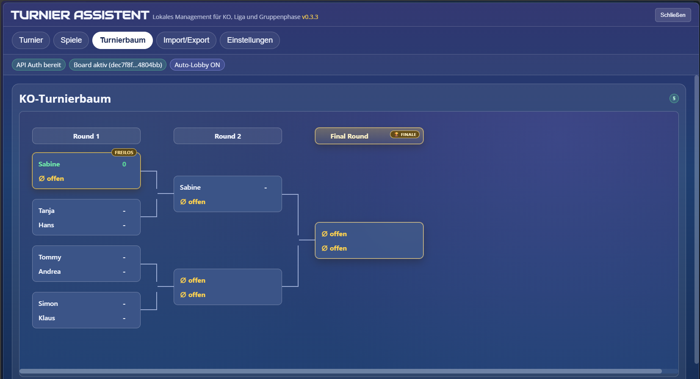
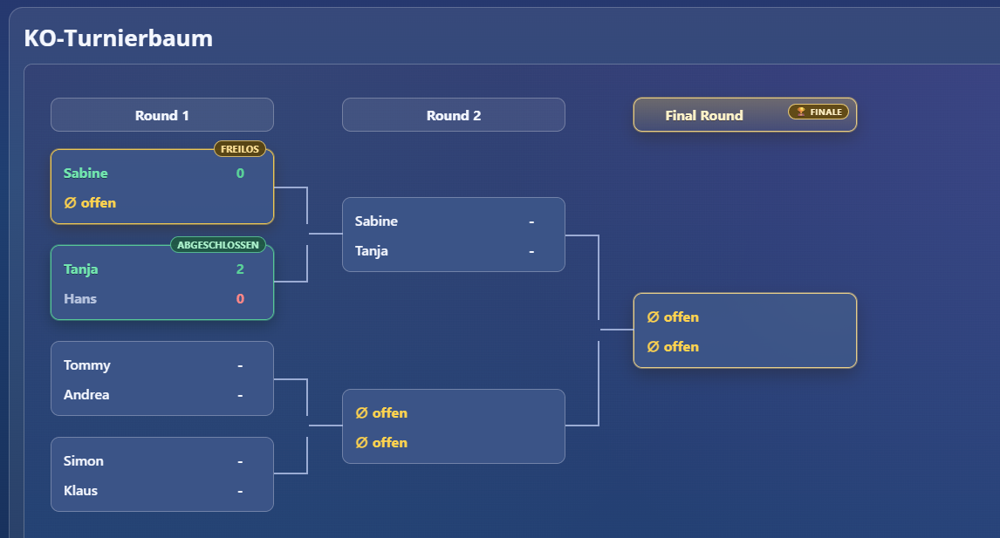
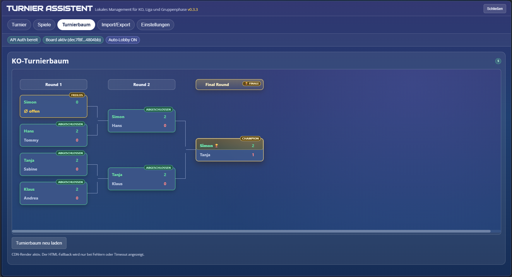

Liga-Ansicht mit Tabelle und Spielplan:

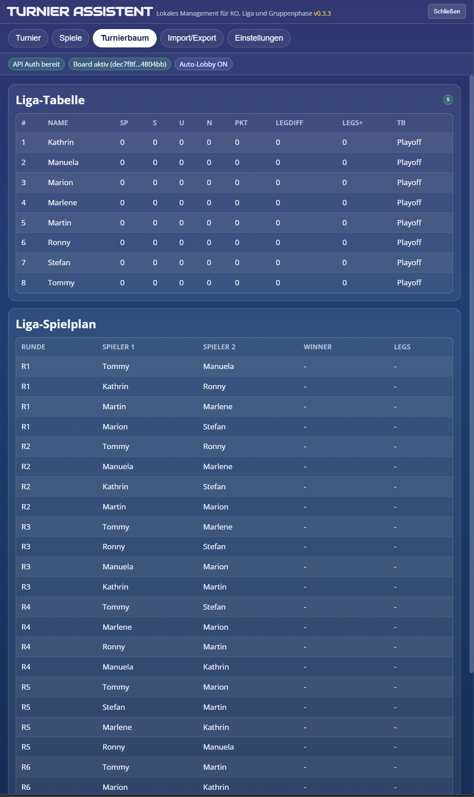

Gruppenphase + KO mit Gruppentabellen und KO-Turnierbaum:

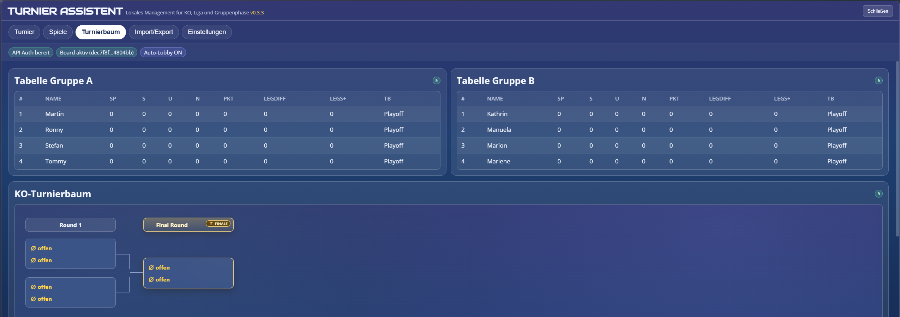

## Import und Export
Tab: `Import/Export`

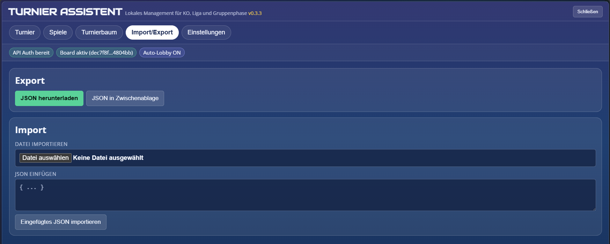

### Export
- `JSON herunterladen`
- `JSON in Zwischenablage`

### Import
- Dateiimport (`.json`)
- JSON-Text direkt einfügen

### Daten- und Migrationshinweise
- Persistenzschema: `schemaVersion: 4`
- Beim Import werden Daten defensiv normalisiert.
- Legacy-KO-Turniere werden auf KO-Engine v3 migriert.
- Vor KO-Migration wird ein Backup unter `ata:tournament:ko-migration-backups:v2` abgelegt.
- Bestehende Turniere werden auf
  `tournament.rules.tieBreakProfile = promoter_h2h_minitable` normalisiert.

## Einstellungen
Tab: `Einstellungen`

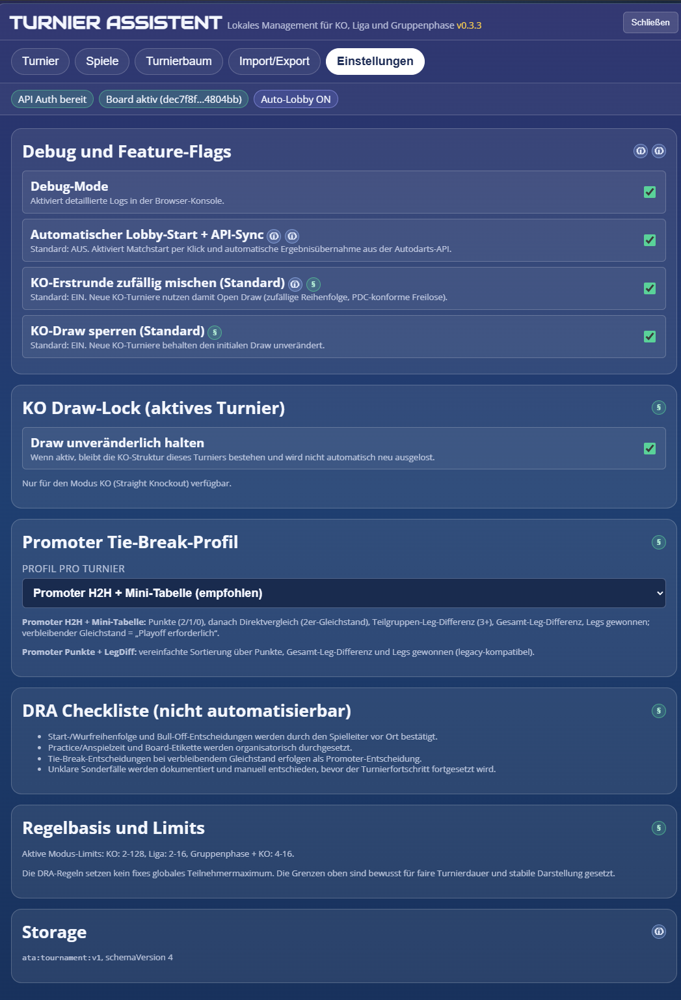

### Info-Symbole
Legende für die eingeblendeten Hilfelinks:

| Symbol | Bedeutung | Typischer Inhalt |
|---|---|---|
|  | `Info-Icon` = technische Information | Bedienung, Implementierung, README-Kontext |
|  | `Regel-Icon` = Regelwerk | DRA-Bezug, Kapitel/Punkt/Seite, Hintergründe |

- Das `Info-Icon` verweist auf Bedienung, Implementierung und interne Projektdokumentation.
- Das `Regel-Icon` verweist auf die zentrale Regelerklärung in [docs/dra-regeln-gui.md](docs/dra-regeln-gui.md).

### Debug-Mode
- Aktiviert ausführliche Logs in der Browser-Konsole.
- Prefix z. B. `[ATA][api]`, `[ATA][bracket]`, `[ATA][storage]`.
- Zusätzlich wird im Tab `Einstellungen` ein kopierbares Matchstart-Debug-Protokoll gespeichert.
- Das Protokoll enthält Vorprüfung, Lobby-Payload, API-Schritte, Fallback-/Cleanup-Infos und Fehlerdetails, aber bewusst kein Auth-Token.
- Sinnvoll für Fehlersuche bei API oder Renderproblemen.

### Script-Update
- Der Tab `Einstellungen` prüft die veröffentlichte GitHub-Version gegen die installierte Runtime-Version.
- Die Prüfung nutzt `dist/autodarts-tournament-assistant.meta.js` als primären Versions-Endpoint und fällt bei Bedarf auf `dist/autodarts-tournament-assistant.user.js` zurück.
- Direkt installierte Runtime:
  - Button `Update installieren` öffnet die veröffentlichte Userscript-Datei mit Cache-Busting.
- Loader aktiv:
  - Bei verfügbarer neuer Runtime genügt `Neu laden`, weil der Loader die aktuelle Dist-Datei beim nächsten Seitenaufruf frisch lädt.
- Der Sidebar-Menüeintrag `xLokales Turnier` markiert verfügbare Updates zusätzlich mit einem Punkt.

### Automatischer Lobby-Start + API-Sync
- Standard: `AUS`.
- Wenn aktiv:
  - `Match starten` erstellt Lobby, fügt Spieler hinzu, startet Match.
  - Duplikatnamen werden bereits vor dem Klick als nicht API-tauglich blockiert.
  - Fehlgeschlagene, noch nicht gestartete Lobbys werden vorsichtig bereinigt.
  - Ergebnis wird automatisch aus der API übernommen.
- Warum: weniger manuelle Schritte, geringeres Risiko für Übertragungsfehler.

### KO-Erstrunde zufällig mischen (Standard)
- Standard: `EIN`.
- Gilt für neu erstellte KO-Turniere.
- `EIN` -> `open_draw` (deterministische Auslosungsreihenfolge in Runde 1).
- `AUS` -> `seeded` (Eingabereihenfolge als Seed-Rang).
- Warum: Turnierleitung kann zwischen offener Auslosung und Setzlogik wählen.

### KO Draw-Lock (Standard)
- Standard: `EIN`.
- Neue KO-Turniere übernehmen den Initial-Draw unverändert (`drawLocked = true`).
- Bezug: DRA `6.12.1` (veröffentlichter Draw bleibt bestehen).
- Im Tab `Einstellungen` ist Entsperren nur als expliziter Promoter-Override mit Bestätigung innerhalb kurzer Frist möglich.
- Warum: Verhindert unfaire oder versehentliche Nachauslosung während laufendem Turnier.

### Turnierzeit-Prognose
- Details zur Berechnungsgrundlage: [docs/tournament-duration.md](docs/tournament-duration.md)
- Das Profil kalibriert sowohl die Leg-Geschwindigkeit als auch die Zeit zwischen Matches und Turnierphasen.
- Zeitprofil:
  - `Schnell`
  - `Normal` (empfohlen)
  - `Langsam`
- Das Profil wirkt als globaler Kalibrierungsfaktor für die Live-Prognose im Tab `Turnier`.
- Unabhängig vom Profil bleiben die fachlichen Einflussgrößen erhalten:
  - Modus und Teilnehmerzahl
  - `Best of Legs`
  - `Startpunkte`
  - `In` / `Out`
  - `Bull-off` / `Bull-Modus`
  - `Max Runden`
- Warum: lokale Felder spielen unterschiedlich schnell; das Profil erlaubt eine saubere Anpassung, ohne die eigentliche Turnierlogik zu verändern.

### Promoter Tie-Break-Profil
- `Promoter H2H + Mini-Tabelle` (empfohlen):
  - Punkte (`2` Sieg, `1` Unentschieden, `0` Niederlage)
  - Direktvergleich bei genau 2 Punktgleichen
  - Teilgruppen-Leg-Differenz bei 3+ Punktgleichen
  - danach Gesamt-Leg-Differenz und Legs gewonnen
  - bei weiterem Gleichstand: `Playoff erforderlich`
- `Promoter Punkte + LegDiff`:
  - vereinfachte, legacy-kompatible Sortierung
  - Reihenfolge: Punkte -> Gesamt-Leg-Differenz -> Legs gewonnen

Warum dieses Feld wichtig ist:
- DRA `6.16.1` erlaubt Tie-Breaks nach Ermessen des Veranstalters.
- Das Profil erzwingt eine klare, reproduzierbare Reihenfolge statt Ad-hoc-Entscheidung.
- Nach dem ersten abgeschlossenen Gruppen-/Liga-Ergebnis ist das Profil gesperrt.

## Regelbasis und Limits
Priorisierung für Limits in diesem Projekt:
1. Offizielle Darts-Regeln
2. Mathematische Turnierlogik
3. Technische Machbarkeit im Userscript

### Offizielle Regelquellen
- DRA-Rulebook-Seite: https://www.thedra.co.uk/dra-rulebook
- DRA-Rulebook-PDF (Projektkopie): [docs/DRA-RULE_BOOK.pdf](docs/DRA-RULE_BOOK.pdf)
- DRA-Referenzen:
  - Definition Bye: Abschnitt `2` (Seite 4):
    [DRA-RULE_BOOK.pdf#page=4](docs/DRA-RULE_BOOK.pdf#page=4)
  - Turnierformat KO / Round Robin: `6.8.1`, `6.8.2` (Seite 17):
    [DRA-RULE_BOOK.pdf#page=17](docs/DRA-RULE_BOOK.pdf#page=17)
  - Teilnehmer und Veranstalter-Ermessen: `6.10.1`, `6.10.5.2` (Seiten 17-18):
    [DRA-RULE_BOOK.pdf#page=18](docs/DRA-RULE_BOOK.pdf#page=18)
  - Draw bleibt bestehen: `6.12.1` (Seite 18):
    [DRA-RULE_BOOK.pdf#page=18](docs/DRA-RULE_BOOK.pdf#page=18)
  - Tie-Break im Ermessen des Veranstalters: `6.16.1` (Seite 20):
    [DRA-RULE_BOOK.pdf#page=20](docs/DRA-RULE_BOOK.pdf#page=20)

### Umgesetzte Limits (mit Hintergrund)
| Modus | Limit | Warum |
|---|---|---|
| `ko` | `2..128` | Regelkonform ohne kleines Kunstlimit; 128 als technischer Stabilitätsdeckel für Bracket/UI. |
| `league` | `2..16` | Round Robin wächst quadratisch (`n*(n-1)/2`); oberhalb 16 wird Dauer und Bedienung für lokale Events schnell unpraktisch. |
| `groups_ko` | `4..16` | Mindestens 4 für zwei Gruppen mit anschliessender KO-Phase; Obergrenze aus Spielanzahl/Bedienbarkeit. |

Hinweise:
- Zusätzliches technisches Hard-Cap: `128` Teilnehmer.
- Die GUI verlinkt Regelhintergründe über das `Regel-Icon` auf [docs/dra-regeln-gui.md](docs/dra-regeln-gui.md).

### Warum diese Regeln für Spieler relevant sind
- **Transparenz:** Jeder sieht, warum ein Match gesperrt/freigeschaltet ist.
- **Fairness:** Draw-Lock und Bye-Handling verhindern spätere Strukturmanipulation.
- **Nachvollziehbarkeit:** Tie-Break-Profil macht Tabellenentscheidungen reproduzierbar.
- **Planbarkeit:** Limits schützen vor Turnierformaten, die lokal kaum sauber durchführbar sind.

## Troubleshooting
### "Match ist abgeschlossen", obwohl neu
- Ursache ist meist ein inkonsistenter Altzustand.
- Lösung:
  1. Seite neu laden.
  2. Falls nötig Turnier neu anlegen.
  3. Prüfen, ob `Freilos` in Runde 1 automatisch weitergeleitet wurde (das ist korrekt).

### "Board-ID ungültig (manual)"
- Einmal in Autodarts manuell eine Lobby öffnen und ein Board setzen.
- Danach Seite neu laden.

### API-Start/Sync funktioniert nicht
- Login prüfen (Token vorhanden?).
- Kurz zu `Lobbies` oder `Matches` wechseln, damit laufende API-Header erneut erfasst werden.
- Feature-Flag aktiv?
- Eindeutige Teilnehmernamen verwenden.
- Bei mehreren offenen Matches mit derselben Paarung wird absichtlich nicht automatisch übernommen (`Mehrdeutige Zuordnung`), um falsche Ergebnisse zu vermeiden.
- `GET /gs/v0/matches/{id}/challenge` kann in der Autodarts-Webapp mit `404` erscheinen; das ist beobachtet und blockiert den ATA-Matchstart-/Sync-Flow nicht.
- Roh-Console-Logs nicht ungefiltert committen oder teilen: SSO-URLs können Einmal-Parameter wie `code`, `state` und `session_state` enthalten.

### Bracket wird nicht gerendert
- CDN kann temporär nicht erreichbar sein.
- Der HTML-Fallback wird dann angezeigt.

## Entwicklung
### Repo-Struktur
```text
autodarts_local_tournament/
|- src/
|  |- core/
|  |- data/
|  |- domain/
|  |- app/
|  |- infra/
|  |- ui/
|  |  |- styles/
|  |  `- render-helpers.js
|  |- bracket/
|  |- runtime/
|- build/
|  |- manifest.json
|  |- version.json
|  `- domain-test-manifest.json
|- scripts/
|  |- build.ps1
|  |- qa.ps1
|  |- qa-architecture.ps1
|  |- qa-build-discipline.ps1
|  |- qa-encoding.ps1
|  |- qa-regelcheck.ps1
|  |- test-domain.ps1
|  `- test-runtime-contract.ps1
|- tests/
|  |- fixtures/
|  |- selftest-runtime.js
|  |- contracts/
|  |- domain-isolation.js
|  |- test-harness.js
|  |- unit-ko-engine.js
|  |- unit-rules-config.js
|  `- unit-standings-dra.js
|- installer/
|  |- Autodarts Tournament Assistant Loader.user.js
|- dist/
|  |- autodarts-tournament-assistant.meta.js
|  |- autodarts-tournament-assistant.user.js
|- docs/
|  |- architecture.md
|  |- codebase-map.md
|  |- dra-compliance-matrix.md
|  |- dra-regeln-gui.md
|  |- pdc-dra-compliance.md
|  |- refactor-guide.md
|  |- selector-strategy.md
|  |- changelog.md
|- assets/
|- README.md
|- LICENSE
```

Die vollständige Datei- und Verbindungsdoku steht in [docs/codebase-map.md](docs/codebase-map.md).

### Hauptdateien
- Quellcode: `src/*`
- Build-Metadaten: `build/manifest.json`, `build/version.json`
- Build/QA: `scripts/*.ps1`
- Runtime-Script: `dist/autodarts-tournament-assistant.user.js`
- Meta-Endpoint für Versionsabgleich: `dist/autodarts-tournament-assistant.meta.js`
- Loader-Script: `installer/Autodarts Tournament Assistant Loader.user.js`

### Build und QA
```powershell
powershell -ExecutionPolicy Bypass -File scripts/build.ps1
powershell -ExecutionPolicy Bypass -File scripts/qa.ps1
```

Gezielte Checks:

```powershell
powershell -ExecutionPolicy Bypass -File scripts/qa-architecture.ps1
powershell -ExecutionPolicy Bypass -File scripts/test-domain.ps1
powershell -ExecutionPolicy Bypass -File scripts/test-runtime-contract.ps1
```

### Architektur
- Shadow DOM für gekapselte UI
- `src/app/*` als Orchestrierungsgrenze zwischen Domain, Persistenz und UI
- SPA-Routing-Hooks für stabile Einbindung in Autodarts
- Defensive Persistenz-Normalisierung
- Bracket-Rendering in sandboxed iframe
- `src/runtime/*` nur noch für Bootstrap-/Wiring

## Limitationen
- Modus-Limits:
  - `ko`: `2..128`
  - `league`: `2..16`
  - `groups_ko`: `4..16`
- Technisches Hard-Cap: `128` Teilnehmer
- API-Halbautomatik basiert auf in der Praxis verwendeten Endpunkten (Inference), siehe [docs/autodarts-api-capabilities.md](docs/autodarts-api-capabilities.md)
- DOM-Autodetect bleibt best-effort

## Quellen
- Turnierdauer-Benchmarks:
  - https://www.aboutthedarts.com/how-to/calculate-the-time-required-for-your-darts-tournament/
  - https://www.bognorregis.com/darts/
  - https://gameandentertain.com/how-long-does-a-game-of-darts-last/
- DRA (offizielle Regelbasis):
  - https://www.thedra.co.uk/dra-rulebook
  - [docs/DRA-RULE_BOOK.pdf](docs/DRA-RULE_BOOK.pdf)
- PDC (Open Draw Kontext, Eventregeln):
  - https://www.pdc.tv/news/2013/01/16/rules-challenge-youth-tours
- JS-Modularisierung:
  - https://developer.mozilla.org/en-US/docs/Web/JavaScript/Guide/Modules
- Tampermonkey Dokumentation:
  - https://www.tampermonkey.net/documentation.php?locale=en
- Tampermonkey FAQ (Injection):
  - https://www.tampermonkey.net/faq.php#Q209
- Referenz-Extension:
  - https://chromewebstore.google.com/detail/autodarts-local-tournamen/algfbicoennnolleogigbefngpkkmcng
- Bracket Viewer:
  - https://github.com/Drarig29/brackets-viewer.js
- Autodarts Themes/Pattern Inspiration:
  - https://github.com/thomasasen/autodarts-tampermonkey-themes
