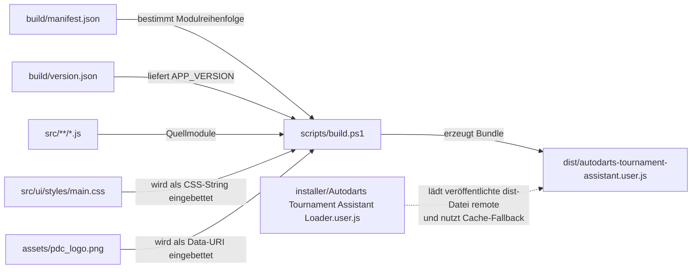
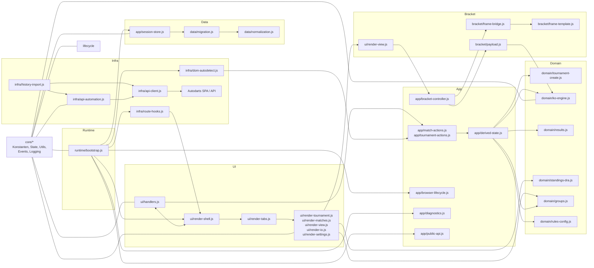

# Technische Codebasis-Karte

## Zweck und Lesepfad
Diese Datei ist der technische Lageplan des Repositories. Sie beantwortet drei Fragen:

1. Wie ist das Projekt in Ordner und Dateien aufgeteilt?
2. Warum liegt welche Verantwortung genau dort?
3. Welche Dateien greifen in Build, Runtime und Wartung ineinander?

Empfohlener Lesepfad:

1. Für die grobe Schichtenlogik zuerst [architecture.md](architecture.md)
2. Für die konkrete Datei- und Verbindungslogik diese Datei
3. Für Änderungsregeln [refactor-guide.md](refactor-guide.md)
4. Für DOM-/Selector-Details [selector-strategy.md](selector-strategy.md)
5. Für Regelbezug [pdc-dra-compliance.md](pdc-dra-compliance.md) und [dra-compliance-matrix.md](dra-compliance-matrix.md)

Der Fokus hier liegt bewusst auf Codeorganisation, Build-Pfad, Runtime-Fluss und den Rollen einzelner Skriptdateien. Diese Datei ist damit die detaillierte Ergänzung zur kürzeren [architecture.md](architecture.md).

## Warum die Aufteilung so ist
- `src/core`: gemeinsame Primitive, Konstanten, State, Logging und kleine Hilfsfunktionen liegen an einer Stelle, weil das Userscript über eine feste Manifest-Reihenfolge zu einer einzigen Datei gebündelt wird und deshalb eine stabile technische Basis braucht.
- `src/data`: Persistenz, Normalisierung und Migration sind von UI und Fachlogik getrennt, damit Import, Export, Legacy-Daten und Schemawechsel kontrollierbar bleiben.
- `src/domain`: fachliche Turnierregeln liegen getrennt von DOM und API, damit KO-, Gruppen-, Liga- und Ergebnislogik nachvollziehbar, testbar und unabhängig von Autodarts-Oberflächenänderungen bleiben.
- `src/app`: die Orchestrierung zwischen reiner Domain-Logik, Persistenz, UI-Re-Render und Bracket-Steuerung liegt bewusst in einer eigenen Schicht, damit Domain-Funktionen rein bleiben und Seiteneffekte einen klaren Ort haben.
- `src/infra`: alle externen Autodarts-Abhängigkeiten sind isoliert, damit Änderungen an API-Endpunkten, Auth oder SPA-Routing nicht die Fachlogik durchziehen.
- `src/ui`: Rendering und Bedienlogik sind getrennt. Die Render-Dateien liefern HTML pro Tab, `handlers.js` ist der UI-Eingang und delegiert fachliche Aktionen in `src/app/*`.
- `src/bracket`: das Third-Party-Bracket-Rendering ist absichtlich gekapselt, weil es in einem isolierten `iframe` mit eigener Message-Bridge und HTML-Fallback läuft; UI-State und Notices liegen nicht mehr im Bracket-Ordner.
- `src/runtime`: bleibt nur als Bootstrap-/Wiring-Schicht bestehen; die eigentliche Browser- und Public-API-Logik liegt nach dem Refactor in `src/app/*` und `src/infra/*`.
- `scripts`, `build`, `installer`, `dist`, `tests`: Entwicklungsworkflow, Build-Artefakte, Loader, ausgeliefertes Bundle und Referenztests bleiben getrennt, damit Quellcode, Tooling und Distribution nicht vermischt werden.

Die Aufteilung ist also nicht nur optisch modular, sondern trennt bewusst:

- technische Basis von Fachregeln
- lokale Datenhaltung von externer API
- HTML-Ausgabe von State-Änderungen
- Source-of-Truth von generierten Artefakten

## Repository-Karte
```text
autodarts_local_tournament/
|- src/
|  |- core/
|  |  |- constants.js
|  |  |- state.js
|  |  |- utils.js
|  |  |- logging.js
|  |  `- events.js
|  |- data/
|  |  |- storage.js
|  |  |- normalization.js
|  |  `- migration.js
|  |- domain/
|  |  |- match-state.js
|  |  |- rules-config.js
|  |  |- tournament-create.js
|  |  |- tournament-duration.js
|  |  |- standings-dra.js
|  |  |- groups.js
|  |  |- ko-engine.js
|  |  `- results.js
|  |- app/
|  |  |- notifications.js
|  |  |- session-store.js
|  |  |- derived-state.js
|  |  |- match-actions.js
|  |  |- tournament-actions.js
|  |  |- match-view-models.js
|  |  |- bracket-controller.js
|  |  |- browser-lifecycle.js
|  |  |- diagnostics.js
|  |  `- public-api.js
|  |- infra/
|  |  |- api-client.js
|  |  |- api-automation.js
|  |  |- dom-autodetect.js
|  |  |- history-import.js
|  |  `- route-hooks.js
|  |- ui/
|  |  |- render-helpers.js
|  |  |- render-shell.js
|  |  |- render-tabs.js
|  |  |- render-tournament.js
|  |  |- render-matches.js
|  |  |- render-view.js
|  |  |- render-io.js
|  |  |- render-settings.js
|  |  |- handlers.js
|  |  `- styles/
|  |     `- main.css
|  |- bracket/
|  |  |- payload.js
|  |  |- frame-template.js
|  |  `- frame-bridge.js
|  `- runtime/
|     |- lifecycle.js
|     |- public-api.js
|     `- bootstrap.js
|- build/
|  |- manifest.json
|  |- version.json
|  `- domain-test-manifest.json
|- scripts/
|  |- build.ps1
|  |- qa.ps1
|  |- qa-architecture.ps1
|  |- qa-build-discipline.ps1
|  |- qa-encoding.ps1
|  |- qa-regelcheck.ps1
|  |- test-domain.ps1
|  `- test-runtime-contract.ps1
|- tests/
|  |- contracts/
|  |- selftest-runtime.js
|  |- test-harness.js
|  |- domain-isolation.js
|  |- unit-ko-engine.js
|  |- unit-tournament-duration.js
|  |- unit-rules-config.js
|  `- unit-standings-dra.js
|  `- fixtures/
|     |- group-deadlock-playoff.json
|     |- ko-seeded-9.json
|     `- migration-v2-to-v3.json
|- installer/
|  `- Autodarts Tournament Assistant Loader.user.js
|- dist/
|  `- autodarts-tournament-assistant.user.js
|- docs/
|  |- architecture.md
|  |- codebase-map.md
|  |- refactor-guide.md
|  |- selector-strategy.md
|  |- pdc-dra-compliance.md
|  |- dra-compliance-matrix.md
|  |- dra-regeln-gui.md
|  |- changelog.md
|  `- DRA-RULE_BOOK.pdf
|- assets/
|  |- Screenshots fuer README und Docs
|  |- pdc_logo.png
|  `- ata-export-*.json
|- README.md
`- LICENSE
```

## Build- und Auslieferungspfad
Der Build bleibt bewusst einfach: kein npm, kein Bundler-Framework, keine Zwischenpakete. Stattdessen werden die Quellmodule in der Reihenfolge aus `build/manifest.json` gelesen, zu einer Userscript-Datei zusammengeführt und mit eingebettetem CSS sowie eingebettetem PDC-Logo ausgegeben.

Praktischer Ablauf:

1. `build/manifest.json` definiert die Reihenfolge der Quelldateien.
2. `build/version.json` ist die zentrale Versionsquelle für das Runtime-Bundle.
3. `scripts/build.ps1` liest diese Dateien, lädt jedes Modul, entfernt alte Split-Marker und fügt die Inhalte zusammen.
4. Dasselbe Skript injiziert die App-Version sowie `src/ui/styles/main.css` und `assets/pdc_logo.png` direkt ins Bundle.
5. Das Ergebnis landet als einzige auslieferbare Datei in `dist/autodarts-tournament-assistant.user.js`.
6. Der Loader in `installer/Autodarts Tournament Assistant Loader.user.js` lädt diese veröffentlichte Dist-Datei remote und nutzt bei Bedarf einen Cache-Fallback.



Wichtig dabei:

- `dist/*` ist ein Artefakt, nicht die Quelle der Wahrheit.
- `constants.js` enthält den Start des Userscripts inklusive Header und IIFE-Beginn.
- `bootstrap.js` schließt das Gesamtbundle als letzte Datei wieder ab.
- Wenn ein neues Quellmodul dazukommt, muss nicht nur die Datei existieren, sondern auch die Reihenfolge im Manifest stimmen.

## Runtime- und Datenfluss
Zur Laufzeit passiert fachlich mehr als ein einfaches UI-Rendern. Das Userscript lädt Persistenz, rendert ein Shadow-DOM-Interface, überwacht die Single-Page-App von Autodarts, startet optional API-Automation, erkennt History-Seiten und synchronisiert Bracket-Rendering im `iframe`.

Die Hauptkette sieht so aus:

1. `src/runtime/bootstrap.js` startet `init()`.
2. `src/app/session-store.js` lädt, migriert und schreibt den gespeicherten Zustand.
3. `src/ui/handlers.js` erzeugt Host und Shell im Shadow DOM.
4. `src/app/browser-lifecycle.js`, `src/infra/dom-autodetect.js`, `src/infra/history-import.js` und `src/infra/route-hooks.js` beobachten DOM, SPA-Routen und History-Seiten.
5. `src/infra/api-automation.js` arbeitet bei aktiviertem Feature-Flag mit `src/infra/api-client.js` gegen die Autodarts-API.
6. `src/ui/render-view.js` stößt für KO-Ansichten das Bracket-Rendering über `src/app/bracket-controller.js` und `src/bracket/*` an.
7. `src/app/public-api.js` veröffentlicht `window.__ATA_RUNTIME`, `src/app/diagnostics.js` hält die Runtime-Selbsttests.



Wichtige Querbeziehungen:

- `core/utils.js` und `data/normalization.js` sind Querschnittsbausteine, deshalb tauchen sie in vielen Bereichen indirekt wieder auf.
- `src/app/*` ist der zentrale Knoten zwischen Benutzeraktion, Persistenz, Domain-Logik, Bracket-Steuerung und Re-Render.
- `domain/ko-engine.js` ist weiterhin der fachliche Motor für Fortschritt, Byes, Draw-Lock und abgeleitete KO-Matches, aber ohne Persistenz-/Logging-Seiteneffekte.
- `infra/dom-autodetect.js` und `infra/history-import.js` verbinden Autodarts-DOM und History-Seiten mit dem lokalen Turnierzustand.

## Dateikatalog nach Ordnern
Die Tabellen unten beschreiben pro Datei:

- was die Datei besitzt
- warum sie in diesem Ordner liegt
- mit welchen Nachbardateien sie hauptsächlich zusammenspielt

### Build und Distribution

| Datei | Rolle | Wichtige Inhalte / Hauptfunktionen | Primäre Verbindungen |
|---|---|---|---|
| `build/manifest.json` | Reihenfolgevertrag des Bundles | listet alle `src/*.js`-Module in deterministischer Reihenfolge | `scripts/build.ps1`, `src/core/constants.js`, `src/runtime/bootstrap.js` |
| `build/version.json` | zentrale Versionsquelle | liefert `APP_VERSION` für Header und Runtime | `scripts/build.ps1`, `src/core/constants.js`, `dist/autodarts-tournament-assistant.user.js` |
| `build/domain-test-manifest.json` | Test-Bundle-Vertrag | definiert, welche Dateien in den isolierten Domain-Harness geladen werden | `scripts/test-domain.ps1`, `tests/test-harness.js`, `tests/unit-*.js` |
| `scripts/build.ps1` | Build-Orchestrierung | liest Manifest und Version, fügt Module zusammen, injiziert Version, bettet CSS und Logo ein, schreibt `dist/*` | `build/manifest.json`, `build/version.json`, `src/ui/styles/main.css`, `assets/pdc_logo.png`, `dist/autodarts-tournament-assistant.user.js` |
| `scripts/qa.ps1` | Gesamt-QA | ruft Build, Architektur-QA, Encoding, Regelcheck, Domain-Harness, Runtime-Contract und Build-Disziplin auf | `scripts/build.ps1`, `scripts/qa-architecture.ps1`, `scripts/test-domain.ps1`, `scripts/test-runtime-contract.ps1`, `scripts/qa-build-discipline.ps1` |
| `scripts/qa-architecture.ps1` | Architektur-Gate | prüft Domain-Reinheit, Runtime-/Bracket-/Storage-Grenzen und UI-Renderer-Regeln | `src/domain/*`, `src/bracket/*`, `src/data/storage.js`, `src/runtime/*`, `src/ui/render-*.js` |
| `scripts/qa-encoding.ps1` | Zeichensatz- und Terminologie-Prüfung | prüft UTF-8, Mojibake und zentrale UI-Begriffe in Quell-, Dist- und Doku-Dateien | `src/*`, `dist/autodarts-tournament-assistant.user.js`, `docs/*`, `README.md` |
| `scripts/qa-regelcheck.ps1` | fachlicher Regex-Check | prüft in `dist/*`, ob zentrale Regelmappings, KO-Logik und Terminologie im Bundle vorkommen | `dist/autodarts-tournament-assistant.user.js`, Domain-Logik aus `src/domain/*` |
| `scripts/test-domain.ps1` | isolierter Domain-Harness | baut einen no-deps Test-Bundle für pure Domain-Logik und führt ihn im Headless-Browser aus | `build/domain-test-manifest.json`, `tests/test-harness.js`, `tests/domain-isolation.js`, `tests/unit-*.js` |
| `scripts/test-runtime-contract.ps1` | Runtime-Contract-Test | lädt `dist/*` im Headless-Browser und prüft `window.__ATA_RUNTIME` plus `runSelfTests()` | `dist/autodarts-tournament-assistant.user.js`, `tests/contracts/*` |
| `scripts/qa-build-discipline.ps1` | Build-Disziplin | prüft Placeholder-Nutzung, Versionseinbau und generiertes `dist/*` | `build/version.json`, `src/core/constants.js`, `dist/autodarts-tournament-assistant.user.js` |
| `installer/Autodarts Tournament Assistant Loader.user.js` | Loader-Skript, nicht App-Logik | lädt die veröffentlichte Dist-Datei remote, validiert sie, cached sie lokal und erzeugt den Menü-Einstieg | `dist/autodarts-tournament-assistant.user.js`, GitHub Raw URL, Tampermonkey GM APIs |
| `dist/autodarts-tournament-assistant.user.js` | generiertes Auslieferungsartefakt | enthält das komplette Userscript als eine Datei; ist Loader-kompatibel und direkt installierbar | `scripts/build.ps1`, `installer/Autodarts Tournament Assistant Loader.user.js`, Browser/Tampermonkey |

### Tests

| Datei | Rolle | Wichtige Inhalte / Hauptfunktionen | Primäre Verbindungen |
|---|---|---|---|
| `tests/contracts/runtime-api-contract.js` | API-Vertrag | hält die erwarteten Runtime-API-Keys und Funktionsnamen fest | `scripts/test-runtime-contract.ps1`, `window.__ATA_RUNTIME` |
| `tests/contracts/globals-contract.js` | Global-Vertrag | hält die erwarteten ATA-Globals und verbotene neue Keys fest | `scripts/test-runtime-contract.ps1`, Browser-Globalobjekt |
| `tests/test-harness.js` | minimaler Test-Runner | registriert Tests, Assertions und Ergebnisaggregation für den no-deps Harness | `scripts/test-domain.ps1`, `tests/domain-isolation.js`, `tests/unit-*.js` |
| `tests/domain-isolation.js` | Isolations-Tests | prüft, dass Domain-Funktionen ohne Runtime-State, DOM-Mocks und Persistenz ausgeführt werden können | `src/domain/*`, `tests/test-harness.js` |
| `tests/unit-ko-engine.js` | KO-Unit-Tests | prüft Seeded-9, Draw-Lock, Winner-Advancement und KO-Migration v3 | `src/domain/ko-engine.js`, `src/domain/tournament-create.js`, `tests/test-harness.js` |
| `tests/unit-rules-config.js` | Rules-Unit-Tests | prüft pure Tie-Break- und Draw-Lock-Mutationen | `src/domain/rules-config.js`, `tests/test-harness.js` |
| `tests/unit-standings-dra.js` | Standings-Unit-Tests | prüft H2H/Mini-Tabelle, Legacy-Profil und `playoff_required` | `src/domain/standings-dra.js`, `tests/test-harness.js` |
| `tests/selftest-runtime.js` | Browser-Konsole-Helfer | ruft `window.__ATA_RUNTIME.runSelfTests()` auf und formatiert das Ergebnis für `console.table` | `src/app/diagnostics.js`, `dist/autodarts-tournament-assistant.user.js` |

### Core

| Datei | Rolle | Wichtige Inhalte / Hauptfunktionen | Primäre Verbindungen |
|---|---|---|---|
| `src/core/constants.js` | technischer Einstieg des Bundles | Userscript-Header, IIFE-Start, globale Keys, URLs, Konfiguration, feste Optionen und Begriffe | `build/manifest.json`, alle folgenden `src/*`-Dateien, `src/runtime/bootstrap.js` |
| `src/core/state.js` | zentraler Laufzeitzustand | hält Drawer-, Tab-, Notice-, Bracket-, API-, Observer- und Store-State | `src/core/utils.js`, `src/data/normalization.js`, `src/data/storage.js`, `src/ui/handlers.js` |
| `src/core/utils.js` | Querschnitts-Helfer | Sanitizing, HTML-Escaping, IDs, Zufall, Teilnehmer-Parsing und Routing-Key | `src/data/normalization.js`, `src/domain/*`, `src/ui/*`, `src/infra/*`, `src/runtime/*` |
| `src/core/logging.js` | Debug- und Fehlerlogging | `logDebug`, `logWarn`, `logError` mit ATA-Präfixen | `src/data/storage.js`, `src/domain/ko-engine.js`, `src/infra/*`, `src/runtime/*`, `src/ui/handlers.js` |
| `src/core/events.js` | Cleanup- und Lifecycle-Utilities | registriert Cleanup-Funktionen, Listener, Intervalle und Observer zentral | `src/infra/route-hooks.js`, `src/runtime/bootstrap.js`, `src/runtime/lifecycle.js`, `src/runtime/public-api.js` |

### Data

| Datei | Rolle | Wichtige Inhalte / Hauptfunktionen | Primäre Verbindungen |
|---|---|---|---|
| `src/data/storage.js` | Persistenz-I/O | GM/localStorage-Lesen und -Schreiben ohne Orchestrierung | `src/data/migration.js`, `src/app/session-store.js` |
| `src/data/normalization.js` | Form- und Store-Normalisierung | Default-Store, Default-Draft, Sanitizer, Turnier-/Match-/KO-Normalisierung, Lookup-Helfer, Limits | `src/core/utils.js`, `src/domain/tournament-create.js`, `src/data/storage.js`, Render- und Domain-Dateien |
| `src/data/migration.js` | Schema- und Bestandsdaten-Migration | migriert alte Speicherstände, normalisiert Regelobjekte und legt KO-Migrations-Backups an | `src/data/storage.js`, `src/data/normalization.js`, `src/domain/ko-engine.js`, `src/runtime/public-api.js` |

Die drei Dateien zusammen bilden die Persistenzstrecke:

`lesen -> migrieren -> normalisieren -> im State halten -> speichern`

### Domain

| Datei | Rolle | Wichtige Inhalte / Hauptfunktionen | Primäre Verbindungen |
|---|---|---|---|
| `src/domain/match-state.js` | gemeinsame Match-Mutationen | `clearMatchResult()` und `assignPlayerSlot()` als reine Match-Helfer | `src/domain/ko-engine.js`, `src/domain/groups.js`, `src/domain/results.js` |
| `src/domain/rules-config.js` | pure Regel-Mutationen | ändert Tie-Break-Profil und KO-Draw-Lock nur am übergebenen Turnierobjekt | `src/data/normalization.js`, `src/app/tournament-actions.js` |
| `src/domain/tournament-create.js` | reine Turniererzeugung | Match-Factory, Round-Robin-Pairings, Seed- und Bye-Logik, Gruppenbildung, KO-Struktur, Validation, `createTournament` | `src/data/normalization.js`, `src/domain/ko-engine.js`, `src/app/tournament-actions.js`, `src/app/diagnostics.js` |
| `src/domain/tournament-duration.js` | pure Zeitprognose | berechnet Matchanzahl, erwartete Legs, Matchdauer und Spannweite für die Turnieranlage ohne DOM-/State-Abhängigkeiten | `src/data/normalization.js`, `src/domain/tournament-create.js`, `src/ui/render-tournament.js`, `src/ui/render-settings.js`, `tests/unit-tournament-duration.js` |
| `src/domain/standings-dra.js` | Tabellen- und Tie-Break-Motor | berechnet Punkte, Leg-Differenzen, Direktvergleich, Mini-Tabelle und `playoff_required` | `src/data/normalization.js`, `src/domain/groups.js`, `src/ui/render-view.js`, `src/runtime/public-api.js` |
| `src/domain/groups.js` | Gruppen-zu-KO-Auflösung | berechnet Gruppentabellen pro Gruppe und belegt bei `groups_ko` die KO-Halbfinal-Slots | `src/domain/standings-dra.js`, `src/domain/ko-engine.js`, `src/ui/render-view.js` |
| `src/domain/ko-engine.js` | fachlicher KO-Motor | Winner-Advancement, Draw-Lock, Byes, KO-Meta-Snapshots, v3-Migration und Ergebnisvalidierung ohne Persistenz-/Logging-Seiteneffekte | `src/data/normalization.js`, `src/domain/groups.js`, `src/domain/tournament-create.js`, `src/domain/match-state.js`, `src/app/derived-state.js` |
| `src/domain/results.js` | pure Ergebnislogik | offenes Match nach Spielern finden, Legs prüfen, Sieger ableiten, Ergebnisse am übergebenen Turnier speichern, Editierbarkeit bestimmen | `src/domain/tournament-create.js`, `src/domain/ko-engine.js`, `src/app/match-actions.js`, `src/infra/api-automation.js` |

Hier liegt die eigentliche Turnierlogik. Wenn sich eine fachliche Regel ändert, ist `src/domain/*` fast immer der erste Ort zum Prüfen.

### App

| Datei | Rolle | Wichtige Inhalte / Hauptfunktionen | Primäre Verbindungen |
|---|---|---|---|
| `src/app/notifications.js` | Notice-Orchestrierung | zentrale `setNotice()`-Funktion inkl. Timer und Re-Render | `src/ui/render-shell.js`, `src/ui/handlers.js`, `src/infra/*`, `src/app/*` |
| `src/app/session-store.js` | Session-Store-Orchestrierung | `loadPersistedStore()`, `schedulePersist()`, `persistStore()` | `src/data/storage.js`, `src/data/migration.js`, `src/app/derived-state.js`, `src/runtime/bootstrap.js` |
| `src/app/derived-state.js` | abgeleiteter Turnierzustand | zentraler Refresh-Workflow für KO-Migration, Gruppen-zu-KO, Bracket-Sync und Results-Index | `src/domain/groups.js`, `src/domain/ko-engine.js`, `src/domain/results.js`, `src/data/migration.js` |
| `src/app/match-actions.js` | Match-Orchestrierung | stateful Wrapper für `updateMatchResult()` mit Persistenz und Re-Render | `src/domain/results.js`, `src/app/derived-state.js`, `src/app/session-store.js` |
| `src/app/tournament-actions.js` | Turnier-Orchestrierung | Erstellen, Import, Reset, Tie-Break- und Draw-Lock-Änderungen am aktiven Turnier | `src/domain/tournament-create.js`, `src/domain/rules-config.js`, `src/app/derived-state.js`, `src/ui/handlers.js` |
| `src/app/match-view-models.js` | UI-nahe Match-ViewModels | Sortierung, Priorisierung und `Nächstes Match` außerhalb des Renderers | `src/domain/results.js`, `src/infra/api-automation.js`, `src/ui/render-matches.js` |
| `src/app/bracket-controller.js` | Bracket-Orchestrierung | Render-Queue, Timeout, Height-Sync, Fallback-Sichtbarkeit und Fehlermeldungen | `src/bracket/frame-bridge.js`, `src/bracket/payload.js`, `src/ui/render-view.js` |
| `src/app/browser-lifecycle.js` | Browser-Lifecycle | Cleanup, Event-Bridge und Runtime-nahe UI-Helfer | `src/infra/history-import.js`, `src/app/bracket-controller.js`, `src/runtime/bootstrap.js` |
| `src/app/diagnostics.js` | Runtime-Diagnostik | `runSelfTests()` für Browser-Konsole und Contract-Test | `src/domain/*`, `src/infra/*`, `src/app/public-api.js`, `scripts/test-runtime-contract.ps1` |
| `src/app/public-api.js` | Public Runtime API | veröffentlicht `window.__ATA_RUNTIME` und bindet Cleanup daran | `src/app/diagnostics.js`, `src/runtime/bootstrap.js`, Browser-Konsole |

### Infra

| Datei | Rolle | Wichtige Inhalte / Hauptfunktionen | Primäre Verbindungen |
|---|---|---|---|
| `src/infra/api-client.js` | dünne API-Grundschicht | liest Auth-Token und Board-ID, baut Status-Bar-Infos auf, kapselt HTTP-Requests und Autodarts-Endpunkte | `src/ui/render-shell.js`, `src/infra/api-automation.js`, `src/app/diagnostics.js` |
| `src/infra/api-automation.js` | Matchstart und Ergebnis-Sync | erstellt Lobbys, fügt Spieler hinzu, startet Matches, synchronisiert API-Ergebnisse und löst Zuordnungsfälle auf | `src/infra/api-client.js`, `src/app/match-actions.js`, `src/app/session-store.js`, `src/app/notifications.js`, `src/ui/handlers.js`, `src/infra/history-import.js` |
| `src/infra/dom-autodetect.js` | DOM-basierte Autoerkennung | erkennt laufende Matchseiten und versucht Ergebnisübernahme aus der DOM | `src/app/match-actions.js`, `src/app/notifications.js`, `src/runtime/bootstrap.js` |
| `src/infra/history-import.js` | History-Import | Statistik-Parsen, Match-Zuordnung auf `/history/matches/{id}` und Inline-Import-UI | `src/infra/api-automation.js`, `src/app/match-actions.js`, `src/app/session-store.js`, `src/app/notifications.js` |
| `src/infra/route-hooks.js` | SPA-Integration | patched `history.pushState` und `replaceState`, reagiert auf Routenwechsel und stößt Re-Render an | `src/core/events.js`, `src/ui/handlers.js`, `src/infra/history-import.js` |

### UI

| Datei | Rolle | Wichtige Inhalte / Hauptfunktionen | Primäre Verbindungen |
|---|---|---|---|
| `src/ui/render-shell.js` | äußerer Drawer-Rahmen | rendert Shadow-DOM-Shell, Tabs, Notices und Runtime-Status-Bar | `src/ui/render-tabs.js`, `src/infra/api-client.js`, `src/ui/handlers.js` |
| `src/ui/render-tabs.js` | Tab-Verteiler | entscheidet, welcher Tab-Renderer für den aktiven Tab ausgeführt wird | `src/ui/render-tournament.js`, `src/ui/render-matches.js`, `src/ui/render-view.js`, `src/ui/render-io.js`, `src/ui/render-settings.js` |
| `src/ui/render-helpers.js` | UI-Helfer | `renderInfoLinks()`, Abschnitts- und Turnierzeit-Helfer für wiederverwendbare HTML-Bausteine | `src/ui/render-*.js` |
| `src/ui/render-tournament.js` | Turnieranlage und Turnierübersicht | rendert Neues-Turnier-Formular, PDC-Preset-Hinweise, Live-Zeitprognose, aktives Turnier und Reset-Bereich | `src/data/normalization.js`, `src/domain/tournament-duration.js`, `src/ui/render-helpers.js`, `src/ui/handlers.js` |
| `src/ui/render-matches.js` | Matchliste und Matchaktionen | rendert Editoren, Status und API-Start-Buttons; Sortierung und `Nächstes Match` kommen aus `src/app/match-view-models.js` | `src/app/match-view-models.js`, `src/domain/results.js`, `src/infra/api-automation.js` |
| `src/ui/render-view.js` | Tabellen- und Bracket-Ansicht | rendert Liga-/Gruppentabellen, Fallback-Bracket und den Einstieg ins iframe-Bracket | `src/domain/standings-dra.js`, `src/domain/groups.js`, `src/domain/ko-engine.js`, `src/bracket/*` |
| `src/ui/render-io.js` | Import/Export-Tab | rendert Export- und Import-Oberfläche | `src/ui/handlers.js`, `src/data/storage.js` |
| `src/ui/render-settings.js` | Settings-Tab | rendert Debug-Flag, API-Automation, KO-Defaults, Zeitprofil, Tie-Break-Profil und Storage-Hinweise | `src/data/normalization.js`, `src/domain/tournament-duration.js`, `src/ui/render-helpers.js`, `src/ui/handlers.js` |
| `src/ui/handlers.js` | UI-Orchestrator | erstellt Host, rendert Shell, bindet Events, liest Formulare, aktualisiert die Live-Zeitprognose und delegiert Turnier-/Match-Aktionen in `src/app/*` | `src/ui/render-shell.js`, `src/app/tournament-actions.js`, `src/app/match-actions.js`, `src/infra/api-automation.js`, `src/app/bracket-controller.js`, `src/domain/tournament-duration.js` |

`handlers.js` ist die Datei, in der Bedienung, State-Änderung und Re-Render zusammenlaufen. Die Render-Dateien bleiben dagegen weitgehend beschreibend.

### Bracket

| Datei | Rolle | Wichtige Inhalte / Hauptfunktionen | Primäre Verbindungen |
|---|---|---|---|
| `src/bracket/payload.js` | Datenadapter für den Viewer | übersetzt interne KO-Matches in das Datenformat des Bracket-Viewers | `src/domain/ko-engine.js`, `src/domain/tournament-create.js`, `src/data/normalization.js`, `src/ui/render-view.js` |
| `src/bracket/frame-template.js` | isolierter iframe-Renderer | erzeugt das komplette `srcdoc` inklusive CDN-Assets, Styling, PostMessage-Protokoll und Fallbacklogik im Frame | `src/bracket/frame-bridge.js`, externe `brackets-viewer`-Assets |
| `src/bracket/frame-bridge.js` | low-level Parent-zu-iframe-Brücke | hält Frame-Reset, Timeout-Helfer, Height-Anpassung und PostMessage-Transport ohne UI-State | `src/bracket/frame-template.js`, `src/app/bracket-controller.js` |

### Runtime

| Datei | Rolle | Wichtige Inhalte / Hauptfunktionen | Primäre Verbindungen |
|---|---|---|---|
| `src/runtime/lifecycle.js` | Wiring-Platzhalter | bleibt als bewusst leere Runtime-Datei im Manifest, damit Runtime bootstrap-only bleibt | `build/manifest.json`, Architektur-Regeln |
| `src/runtime/public-api.js` | Wiring-Platzhalter | bleibt als bewusst leere Runtime-Datei im Manifest; die echte API lebt in `src/app/public-api.js` | `build/manifest.json`, Architektur-Regeln |
| `src/runtime/bootstrap.js` | Startpunkt des Userscripts | lädt Store, rendert UI, installiert Hooks, Browser-Lifecycle und Intervalle, setzt Runtime-Ready-Status | `src/app/session-store.js`, `src/ui/handlers.js`, `src/app/browser-lifecycle.js`, `src/infra/route-hooks.js`, `src/infra/dom-autodetect.js`, `src/app/public-api.js` |

## Unterstützende Dateien und Referenzmaterial

### `src/ui/styles/main.css`
- enthält das komplette Shadow-DOM-Styling der UI
- wird nicht separat ausgeliefert, sondern durch `scripts/build.ps1` in das Bundle eingebettet
- ist deshalb Quellmaterial, aber kein eigener Runtime-Ladepunkt

### `tests/fixtures/*.json`
- `group-deadlock-playoff.json`: Referenzfall für nicht auflösbare Gruppen-Gleichstände
- `ko-seeded-9.json`: Referenzfall für KO-Seeding mit 9 Teilnehmern und genau einem offenen Match in Runde 1
- `migration-v2-to-v3.json`: Referenzfall für KO-Migration auf Engine v3

Diese Dateien sind keine aktive Logik, aber wichtig, um fachliche Spezialfälle reproduzierbar zu halten.

### `assets/*`
- Screenshots für README und Doku
- `pdc_logo.png` für das PDC-Badge im Bundle
- Beispiel-Export `ata-export-*.json` als Referenzmaterial

Assets erklären das Produkt und speisen zum Teil den Build, tragen aber keine Laufzeitlogik.

### `docs/DRA-RULE_BOOK.pdf`
- lokale Regelreferenz im Repository
- dient als dokumentarische Grundlage für die DRA/PDC-bezogenen Docs
- ist keine operative Projektdatei

## Pflegehinweise für künftige Änderungen
- Neue Quellmodule immer auch in `build/manifest.json` eintragen. Die Datei existiert nicht nur dokumentarisch, sondern steuert die tatsächliche Bundle-Reihenfolge.
- `dist/autodarts-tournament-assistant.user.js` nicht manuell pflegen. Änderungen gehören in `src/*`, `src/ui/styles/main.css` oder `assets/*`.
- Neue Fachregeln zuerst in `src/domain/*` verorten, nicht in Render-Dateien oder API-Schichten.
- Neue Persistenzfelder immer mit Blick auf `src/data/normalization.js` und `src/data/migration.js` einführen.
- Wenn UI-Hilfelinks, Regelbegriffe oder Doku-Einstiegspunkte geändert werden, auch `README.md`, `docs/architecture.md` und gegebenenfalls `docs/dra-regeln-gui.md` mitprüfen.
- Bei Änderungen an API- oder DOM-Erkennung zusätzlich `docs/selector-strategy.md` und die `app`-/`infra`-Dateien synchron halten.
- Für strukturelle Änderungen immer auch `scripts/qa-architecture.ps1`, `scripts/test-domain.ps1` und `scripts/test-runtime-contract.ps1` ausführen.
- Für reine Doku-Änderungen reicht in der Regel `scripts/qa-encoding.ps1`; `scripts/qa.ps1` baut zusätzlich `dist/*` neu und ist nur nötig, wenn inhaltlich auch Runtime-Code betroffen ist.
