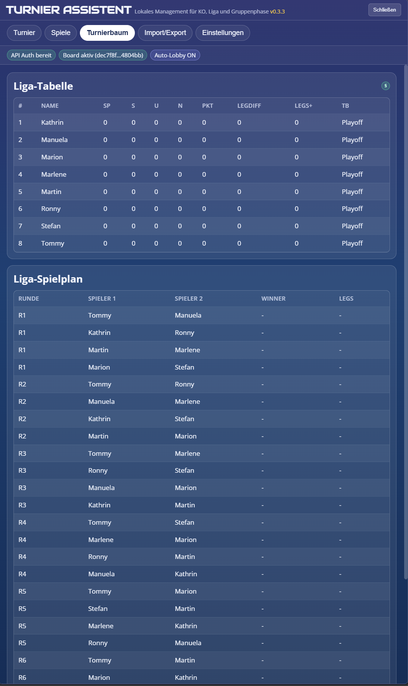
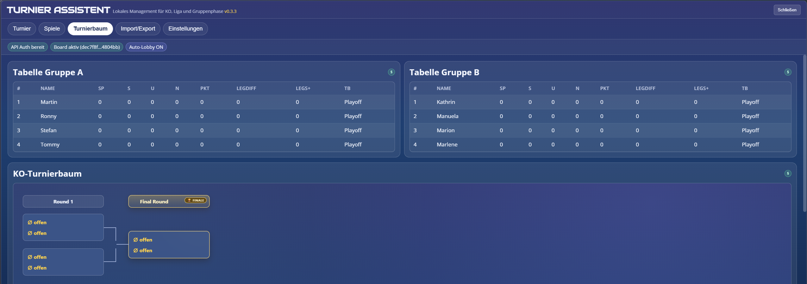

# DRA-Regelerklärungen für die GUI

Diese Datei ist die zentrale Regelhilfe für die Regel-Icons in der Oberfläche.
Jeder Abschnitt enthält:
1. GUI-Stellen
2. DRA-Referenz (Kapitel/Punkt/Seite)
3. Deutsche Erklärung
4. Warum das für Spieler/Turnierleitung wichtig ist
5. Nachprüfen im PDF

## Symbol-Legende in der GUI
| Symbol | Bedeutung | Typischer Link-Zweck |
|---|---|---|
|  | `Info-Icon` = technische Information | Bedienung, Workflow, Projektdoku |
|  | `Regel-Icon` = Regelwerk | DRA-Bezug mit Kapitel/Punkt/Seite |

Screenshot-Kontext:

## Modus und Format

### GUI-Stellen
- Turnier > Modus
- Turnier > Aktives Turnier > Format

### DRA-Referenz (Kapitel/Punkt/Seite)
- `6.8.1`, Seite `17`
- `6.8.2`, Seite `17`

### Deutsche Erklärung
- `6.8.1`: Das Grundprinzip ist KO (Straight Knockout).
- `6.8.2`: Round Robin ist ebenfalls zulässig.
- In der App bedeutet das:
  - `KO`, `Liga` und `Gruppenphase + KO` sind regelkonforme Turniermodelle.
  - Der Modus steuert automatisch Spielplan, Fortschrittslogik und Turnieransicht.

### Warum wichtig
- Spieler sehen früh, wie sie weiterkommen (KO) oder wie gewertet wird (Liga).
- Turnierleitung kann den Ablauf vor Start klar festlegen und später konsistent halten.

### Nachprüfen im PDF
- [DRA-RULE_BOOK.pdf#page=17](DRA-RULE_BOOK.pdf#page=17)

## Open Draw

### GUI-Stellen
- Turnier > KO-Erstrunde zufällig mischen
- Einstellungen > KO-Erstrunde zufällig mischen (Standard)

### DRA-Referenz (Kapitel/Punkt/Seite)
- `6.12.1`, Seite `18`

### Deutsche Erklärung
- Der Schalter bestimmt nur, **wie Runde 1 erzeugt wird**:
  - `open_draw`: zufällige Reihenfolge für Runde 1.
  - `seeded`: feste Reihenfolge nach Eingabe.
- Nach Veröffentlichung des Draws bleibt die Struktur bestehen (`6.12.1`).

### Warum wichtig
- Die Entscheidung zwischen Zufallsdraw und Setzlogik ist vor Start transparent.
- Nach Start gibt es keine "heimliche" Neuverteilung durch Bedienfehler.

### Nachprüfen im PDF
- [DRA-RULE_BOOK.pdf#page=18](DRA-RULE_BOOK.pdf#page=18)

## Draw-Lock

### GUI-Stellen
- Einstellungen > KO-Draw sperren (Standard)
- Einstellungen > KO Draw-Lock (aktives Turnier)

### DRA-Referenz (Kapitel/Punkt/Seite)
- `6.12.1`, Seite `18`

### Deutsche Erklärung
- Draw-Lock ist die technische Absicherung der Regel:
  - Aktiv: KO-Struktur bleibt unverändert.
  - Inaktiv: Turnierleitung kann bewusst entsperren.

### Warum wichtig
- Verhindert unfaire Nachauslosungen im laufenden Turnier.
- Macht Entscheidungen der Turnierleitung nachvollziehbar und dokumentierbar.

### Nachprüfen im PDF
- [DRA-RULE_BOOK.pdf#page=18](DRA-RULE_BOOK.pdf#page=18)

## Teilnehmerlimits

### GUI-Stellen
- Turnier > Modus-Limits
- Einstellungen > Regelbasis und Limits

### DRA-Referenz (Kapitel/Punkt/Seite)
- `6.10.1`, Seite `17`
- `6.10.5.2`, Seite `18`

### Deutsche Erklärung
- Das DRA-Rulebook setzt kein fixes globales Software-Maximum.
- Es gibt Veranstalter-Ermessen für Organisation und Ablauf.
- Die App setzt daher bewusste Leitplanken:
  - `ko`: `2..128`
  - `league`: `2..16`
  - `groups_ko`: `4..16`

### Warum wichtig
- Schützt vor Formaten, die lokal organisatorisch kaum sauber zu spielen sind.
- Erhöht Stabilität (Rendering, Browserlast, Bedienbarkeit).

### Nachprüfen im PDF
- [DRA-RULE_BOOK.pdf#page=17](DRA-RULE_BOOK.pdf#page=17)
- [DRA-RULE_BOOK.pdf#page=18](DRA-RULE_BOOK.pdf#page=18)

## Freilos (Bye)

### GUI-Stellen
- Turnierbaum > KO-Turnierbaum
- Spiele > Ergebnisführung (Freilos-Markierungen)

### DRA-Referenz (Kapitel/Punkt/Seite)
- Abschnitt `2` (Definition `Bye`), Seite `4`
- `6.12.1`, Seite `18`

### Deutsche Erklärung
- Ein `Bye` ist ein reguläres Freilos für eine Runde.
- Spieler mit Bye rücken ohne Match in die nächste Runde vor.
- Byes sind Teil des Draws und werden als `Freilos (Bye)` angezeigt.

### Warum wichtig
- Verhindert Missverständnis "Ghost-Spieler" vs. echtes Freilos.
- Sichert faire Bracket-Mathematik bei Teilnehmerzahlen ohne 2er-Potenz.

### Nachprüfen im PDF
- [DRA-RULE_BOOK.pdf#page=4](DRA-RULE_BOOK.pdf#page=4)
- [DRA-RULE_BOOK.pdf#page=18](DRA-RULE_BOOK.pdf#page=18)

## Tie-Break

### GUI-Stellen
- Einstellungen > Promoter Tie-Break-Profil
- Turnierbaum > Liga-Tabelle / Gruppentabellen
- Turnierbaum > Gruppenentscheidung offen

### DRA-Referenz (Kapitel/Punkt/Seite)
- `6.16.1`, Seite `20`

### Deutsche Erklärung
- DRA erlaubt Tie-Breaks nach Ermessen des Veranstalters.
- Die App bildet dieses Ermessen als wählbares Profil ab:
  - `Promoter H2H + Mini-Tabelle` (empfohlen)
  - `Promoter Punkte + LegDiff`
- Falls ein Gleichstand damit nicht auflösbar ist:
  - Status `Playoff erforderlich`
  - KO-Qualifikation bleibt bis zur Entscheidung blockiert

### Warum wichtig
- Keine stillen, zufälligen oder intransparenten Tabellenentscheidungen.
- Spieler und Turnierleitung sehen eindeutig, wann eine manuelle Entscheidung nötig ist.

### Nachprüfen im PDF
- [DRA-RULE_BOOK.pdf#page=20](DRA-RULE_BOOK.pdf#page=20)

Screenshot-Kontext:

Liga-Ansicht mit Tabelle, Spielplan und sichtbarer Tie-Break-Spalte:

Gruppenphase + KO mit Gruppentabellen und nachgelagertem KO-Turnierbaum:

## DRA-Checkliste (manuelle Entscheidungen)

### GUI-Stellen
- Einstellungen > DRA Checkliste (nicht automatisierbar)

### DRA-Referenz (Kapitel/Punkt/Seite)
- `5.14`, Seite `15`
- `11.3`, Seite `26`
- `11.4`, Seite `26`
- `12.1`, Seite `27`
- `12.2`, Seite `27`

### Deutsche Erklärung
- Einige Punkte sind absichtlich nicht automatisiert:
  - Start-/Wurfreihenfolge, Bull-Off-Entscheidungen
  - Disziplinarische und organisatorische Entscheidungen
  - Strittige Sonderfälle
- Die Software dokumentiert und unterstützt, ersetzt aber keine offizielle Turnierentscheidung.

### Warum wichtig
- Klare Trennung zwischen Software-Automation und offizieller Turnierhoheit.
- Verhindert falsche Erwartung, dass jeder Regelfall algorithmisch "automatisch richtig" entschieden wird.

### Nachprüfen im PDF
- [DRA-RULE_BOOK.pdf#page=15](DRA-RULE_BOOK.pdf#page=15)
- [DRA-RULE_BOOK.pdf#page=26](DRA-RULE_BOOK.pdf#page=26)
- [DRA-RULE_BOOK.pdf#page=27](DRA-RULE_BOOK.pdf#page=27)
