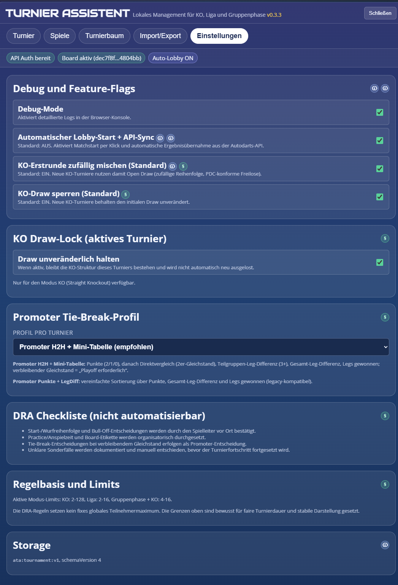

# DRA-Regelerklärungen für die GUI

Diese Datei ist die zentrale Regelhilfe für die Regel-Icons in der Oberfläche.
Jeder Abschnitt enthält:
1. GUI-Stellen
2. DRA-Referenz (Kapitel/Punkt/Seite)
3. Deutsche Erklärung
4. Warum das für Spieler/Turnierleitung wichtig ist
5. Nachprüfen im PDF

## Symbol-Legende in der GUI
| Symbol | Bedeutung | Typischer Link-Zweck |
|---|---|---|
|  | `Info-Icon` = technische Information | Bedienung, Workflow, Projektdoku |
|  | `Regel-Icon` = Regelwerk | DRA-Bezug mit Kapitel/Punkt/Seite |

Screenshot-Kontext:

## Zugängliche Nutzung der Regelhilfe

- Die kontextbezogenen `?`-Auslöser in der Turnieranlage sind echte Buttons mit konkretem zugänglichem Namen, `aria-controls` und synchronem `aria-expanded`.
- Beim Öffnen erhält die Panelüberschrift den Fokus. `Hilfe schließen` oder das erste `Escape` stellt die Turnierübersicht wieder her und gibt den Fokus an den auslösenden Button zurück; ein geöffnetes Spielregel-Disclosure bleibt dabei unverändert. Ein weiteres `Escape` schließt den Assistant-Drawer.
- Nach Anlage oder Import erhält die Spieleüberschrift den Fokus, nach Reset die Überschrift der Turniererstellung und nach Tabwechsel der aktivierte Navigationsbutton. Normale Feldaktualisierungen erhalten Fokus und Textauswahl innerhalb derselben Ansicht.
- Quellenlinks, Formularfelder und Drawer-Navigation sind vollständig per Tastatur erreichbar und besitzen sichtbaren Fokus. Reduced Motion, Forced Colors und 44-px-Grobzeigerziele werden unterstützt.
- Diese Bedienhilfen ändern keine DRA-/PDC-Regelwirkung und keine Einstufung in der Compliance-Matrix. Sie machen ausschließlich die vorhandenen Erklärungen und Veranstaltergrenzen zugänglicher.

## Modus und Format

### GUI-Stellen
- Turnier > Modus
- Turnier > Aktives Turnier > Format

### DRA-Referenz (Kapitel/Punkt/Seite)
- `6.8.1`, Seite `17`
- `6.8.2`, Seite `18`

### Deutsche Erklärung
- `6.8.1`: Das Grundprinzip ist KO (Straight Knockout).
- `6.8.2`: Round Robin ist ebenfalls zulässig.
- In der App bedeutet das:
  - `KO`, `Doppel-KO`, `Liga`, `Gruppenphase + KO` und `Vorrunde + Finalphase` sind technisch unterstützte Turniermodelle; die konkrete Turnierordnung bestimmt, ob die gewählte Konfiguration für eine Veranstaltung passt.
  - Der Modus steuert automatisch Spielplan, Fortschrittslogik und Turnieransicht.
  - `groups_ko` bildet genau zwei Round-Robin-Gruppen mit Top 2 und anschließender Kreuz-KO-Phase ab. Andere offizielle Formate werden nicht automatisch angenähert.

### Warum wichtig
- Spieler sehen früh, wie sie weiterkommen (KO) oder wie gewertet wird (Liga).
- Turnierleitung kann den Ablauf vor Start klar festlegen und später konsistent halten.

### Nachprüfen im PDF
- [DRA-RULE_BOOK.pdf#page=17](DRA-RULE_BOOK.pdf#page=17)
- [DRA-RULE_BOOK.pdf#page=18](DRA-RULE_BOOK.pdf#page=18)

### Ungerade Teilnehmerzahl in `groups_ko`

- Die konkrete Behandlung ist eine Turnier- beziehungsweise Veranstalterregel; das DRA-Regelwerk gibt dafür keine universelle Policy vor.
- `require_even` ist der sichere Produktstandard der Anwendung und verlangt gleich große Gruppen.
- `allow_unequal` erhält die deterministische A/B-Aufteilung als ausdrücklich gewählte Veranstalterregel. Bei ungerader Teilnehmerzahl muss bestätigt werden, dass unterschiedliche Gruppengrößen und Qualifikationsquoten der konkreten Turnierordnung entsprechen.
- Eine Auswahl begründet weder offiziellen Status noch eine allgemeine Verbandskonformität.
- Nicht durch zwei Gruppen, vollständiges Round Robin und Top 2 abbildbare Formate liegen außerhalb des unterstützten Scopes.

### `Vorrunde + Finalphase` als Veranstalterprofil

- Der neue Modus verteilt deterministisch exakt gleich viele reale Vorrundenmatches auf alle Teilnehmer. Die konfigurierten `4..8` bedeuten Matches je Teilnehmer; Scheduling-Runden sind nur eine kollisionsfreie Ablaufgruppierung.
- Das Vorrundenformat spielt immer genau zwei Legs und erlaubt `1:1`. Punktevergabe, Rangfolge `Punkte -> Leg-Differenz -> gewonnene Legs`, Qualifikantenzahl und Finalphasentyp werden als Veranstalterregeln gespeichert.
- Ein Gleichstand am Qualifikations-Cutoff wird nicht zufällig entschieden. Die Finalphase bleibt bis zu einer sichtbaren, begründeten Veranstalterentscheidung gesperrt.
- Die Finalphase verwendet Tabellenplatz 1 als Seed 1 usw. und wird nicht neu ausgelost.
- Weil die belegbare AutoDarts-API keine exakte Abbildung zweier einzelner Legs samt geregeltem Anwurf garantiert, bleibt der API-Start für dieses Vorrundenformat gesperrt. Die Anwendung verwendet weder First to 2 noch Best of 3 als Näherung.
- Diese konkrete Paarung, Wertung und Qualifikation ist kein allgemeines DRA-, PDC-, WDF- oder Verbandsformat. Ein offizielles Turnier ist nur korrekt abgebildet, wenn das gespeicherte Profil der veröffentlichten Turnierordnung entspricht.

## Open Draw

### GUI-Stellen
- Turnier > KO-Erstrunde zufällig mischen
- Einstellungen > KO-Erstrunde zufällig mischen (Standard)

### DRA-Referenz (Kapitel/Punkt/Seite)
- `6.12.1`, Seite `19`

### Deutsche Erklärung
- Der Schalter bestimmt nur, **wie Runde 1 erzeugt wird**:
  - `open_draw`: vom Tool gemischte Auslosungsreihenfolge für Runde 1; dies ist eine Produktfunktion und keine Behauptung, einen externen offiziellen Live-Draw durchzuführen.
  - `seeded`: feste Reihenfolge nach Eingabe.
- Nach Veröffentlichung des Draws bleibt die Struktur bestehen (`6.12.1`).

### Warum wichtig
- Die Entscheidung zwischen Zufallsdraw und Setzlogik ist vor Start transparent.
- Nach Start gibt es keine "heimliche" Neuverteilung durch Bedienfehler.

### Nachprüfen im PDF
- [DRA-RULE_BOOK.pdf#page=19](DRA-RULE_BOOK.pdf#page=19)

## Draw-Lock

### GUI-Stellen
- Einstellungen > KO-Draw sperren (Standard)
- Einstellungen > KO Draw-Lock (aktives Turnier)

### DRA-Referenz (Kapitel/Punkt/Seite)
- `6.12.1`, Seite `19`

### Deutsche Erklärung
- Draw-Lock ist die technische Absicherung der Regel:
  - Aktiv: KO-Struktur bleibt unverändert.
  - Inaktiv: Turnierleitung kann bewusst entsperren, aber nur per explizitem Promoter-Override mit Bestätigung.

### Warum wichtig
- Verhindert unfaire Nachauslosungen im laufenden Turnier.
- Macht Entscheidungen der Turnierleitung nachvollziehbar und dokumentierbar.

### Nachprüfen im PDF
- [DRA-RULE_BOOK.pdf#page=19](DRA-RULE_BOOK.pdf#page=19)

## Spiel um Platz 3 (optional)

### GUI-Stellen
- Turnier > Spiel um Platz 3 (optional)
- Turnier > Aktives Turnier > Tag `Spiel um Platz 3: aktiv/aus`
- Turnierbaum > KO-Turnierbaum (`Consolation Final` / separate Bronze-Sektion im Fallback)

### DRA-Referenz (Kapitel/Punkt/Seite)
- `6.8.1`, Seite `17`
- `6.12.1`, Seite `19`
- `1.2` und `6.8.4` (separate Tournament-/Promoter-Rules möglich)

### Deutsche Erklärung
- Standard bleibt KO mit genau einem Finale (`6.8.1`).
- Das Platz-3-Spiel ist eine **explizite Zusatzregel** und wird nur per Option bei Anlage/Import aktiviert.
- Das Hauptfinale bleibt fachlich getrennt; Bronze hat keinen Einfluss auf den Champion-Pfad.
- Die Option ist draw-stabil gedacht: kein stilles Umschalten im laufenden Turnier (`6.12.1`).

### Warum wichtig
- Klare Trennung zwischen Standardregel und optionaler Veranstalterregel.
- Keine versteckten Strukturänderungen nach Draw-Veröffentlichung.
- Bei Byes/Edgecases werden keine irreführenden oder unvollständigen Placement-Pfade angezeigt.

### Nachprüfen im PDF
- [DRA-RULE_BOOK.pdf#page=17](DRA-RULE_BOOK.pdf#page=17)
- [DRA-RULE_BOOK.pdf#page=19](DRA-RULE_BOOK.pdf#page=19)

## Teilnehmerlimits

### GUI-Stellen
- Turnier > Modus-Limits
- Einstellungen > Regelbasis und Limits

### DRA-Referenz (Kapitel/Punkt/Seite)
- `6.10.1`, Seite `18`

### Deutsche Erklärung
- Das DRA-Rulebook setzt kein fixes globales Software-Maximum.
- `6.10.1` überlässt die Zulassung zu einem Event dem Veranstalter. Daraus folgt kein DRA-Softwarelimit; die folgenden Grenzen sind ausschließlich technische und organisatorische Produktleitplanken.
- Die App setzt daher bewusste Leitplanken:
  - `ko`: `2..128`
  - `double_ko`: `2..32`
  - `league`: `2..16`
  - `groups_ko`: `4..16`
  - `preliminary_final`: `5..16`

### Warum wichtig
- Schützt vor Formaten, die lokal organisatorisch kaum sauber zu spielen sind.
- Erhöht Stabilität (Rendering, Browserlast, Bedienbarkeit).

### Nachprüfen im PDF
- [DRA-RULE_BOOK.pdf#page=18](DRA-RULE_BOOK.pdf#page=18)

## Freilos (Bye)

### GUI-Stellen
- Turnierbaum > KO-Turnierbaum
- Spiele > Ergebnisführung (Freilos-Markierungen)

### DRA-Referenz (Kapitel/Punkt/Seite)
- Abschnitt `2` (Definition `Bye`), Seite `4`
- `6.12.1`, Seite `19`

### Deutsche Erklärung
- Ein `Bye` ist ein reguläres Freilos für eine Runde.
- Spieler mit Bye rücken ohne Match in die nächste Runde vor.
- Byes sind Teil des Draws und werden als `Freilos (Bye)` angezeigt.

### Warum wichtig
- Verhindert Missverständnis "Ghost-Spieler" vs. echtes Freilos.
- Sichert die deterministische Bracket-Mathematik des im Projekt verwendeten Seed-Placements bei Teilnehmerzahlen ohne 2er-Potenz.

### Nachprüfen im PDF
- [DRA-RULE_BOOK.pdf#page=4](DRA-RULE_BOOK.pdf#page=4)
- [DRA-RULE_BOOK.pdf#page=19](DRA-RULE_BOOK.pdf#page=19)

## Tie-Break

### GUI-Stellen
- Einstellungen > Promoter Tie-Break-Profil
- Turnierbaum > Liga-Tabelle / Gruppentabellen
- Turnierbaum > Gruppenentscheidung offen

### DRA-Referenz (Kapitel/Punkt/Seite)
- `6.16.1`, Seite `21`

### Deutsche Erklärung
- DRA `6.16.1` schreibt keine konkrete universelle Tie-Break-Reihenfolge vor, sondern überlässt diese dem Veranstalter.
- Die App bildet dieses Ermessen als wählbares Profil ab:
  - `Veranstalterprofil: Direktvergleich und Minitabelle` (empfohlen)
  - `Veranstalterprofil: Punkte und Leg-Differenz`
- Nach dem ersten abgeschlossenen Gruppen-/Liga-Ergebnis ist das Profil gesperrt (keine nachträgliche Umstellung).
- Falls ein Gleichstand damit nicht auflösbar ist:
  - Status `Playoff erforderlich`
  - KO-Qualifikation bleibt bis zur Entscheidung blockiert

### Warum wichtig
- Keine stillen, zufälligen oder intransparenten Tabellenentscheidungen.
- Spieler und Turnierleitung sehen eindeutig, wann eine manuelle Entscheidung nötig ist.

### Nachprüfen im PDF
- [DRA-RULE_BOOK.pdf#page=21](DRA-RULE_BOOK.pdf#page=21)

Screenshot-Kontext:

Liga-Ansicht mit Tabelle, Spielplan und sichtbarer Tie-Break-Spalte:

Gruppenphase + KO mit Gruppentabellen und nachgelagertem KO-Turnierbaum:

## DRA-Checkliste (manuelle Entscheidungen)

### GUI-Stellen
- Einstellungen > DRA Checkliste (nicht automatisierbar)

### DRA-Referenz (Kapitel/Punkt/Seite)
- `6.8.3`, Seite `18`
- `6.13.1` bis `6.13.7`, Seite `20`
- `6.15.1`, Seite `20`

### Deutsche Erklärung
- Einige Punkte sind absichtlich nicht automatisiert:
  - Start-/Wurfreihenfolge, Bull-Off-Entscheidungen
  - organisatorische Entscheidungen des Veranstalters und der Offiziellen
  - strittige Sonderfälle im laufenden Turnier
- Die Software dokumentiert und unterstützt, ersetzt aber keine offizielle Turnierentscheidung.

### Warum wichtig
- Klare Trennung zwischen Software-Automation und offizieller Turnierhoheit.
- Verhindert falsche Erwartung, dass jeder Regelfall algorithmisch "automatisch richtig" entschieden wird.

### Nachprüfen im PDF
- [DRA-RULE_BOOK.pdf#page=18](DRA-RULE_BOOK.pdf#page=18)
- [DRA-RULE_BOOK.pdf#page=20](DRA-RULE_BOOK.pdf#page=20)
