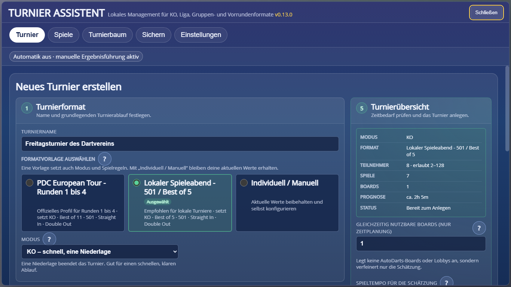
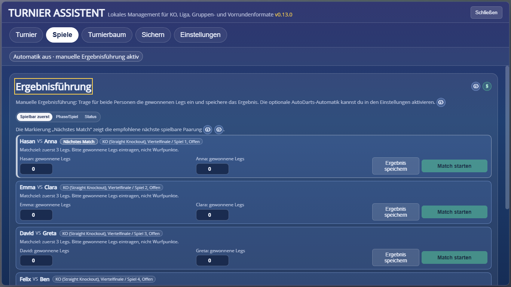
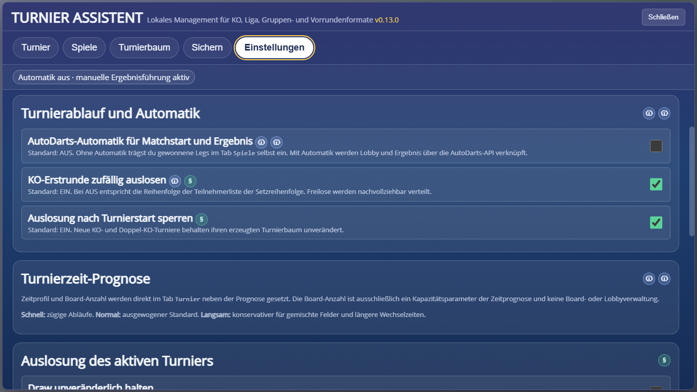
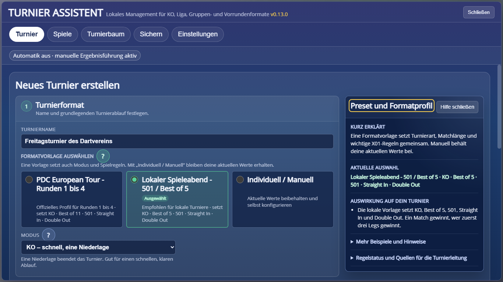
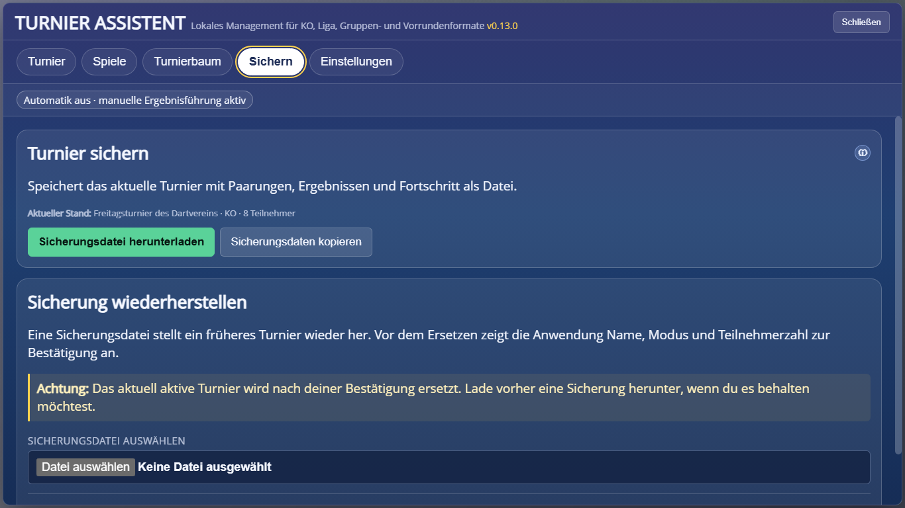

# Einstieg: das erste lokale Dartturnier

Dieser Leitfaden führt ohne Vorwissen durch die Turnieranlage und Ergebnisführung. Fachbegriffe sind im [Glossar](begriffe.md) erklärt. Hinweise für erfahrene Turnierleitungen stehen bewusst getrennt im [Veranstalter-Handbuch](veranstalter-handbuch.md).

## Vor dem Start

Du benötigst:

- einen Browser mit Tampermonkey und installiertem ATA Loader,
- eine geöffnete Sitzung in `play.autodarts.io`,
- mindestens zwei Teilnehmer,
- mindestens ein Dartboard.

Ein AutoDarts-Token oder erkanntes Board ist für die manuelle Ergebnisführung nicht nötig. Diese technischen Voraussetzungen brauchst du erst, wenn du die optionale Automatik aktivierst.

## Erstes Turnier in fünf Minuten

### 1. Turnier benennen

Öffne `xLokales Turnier` und den Tab `Turnier`. Gib einen Namen ein, zum Beispiel `Freitagsturnier`.

### 2. Formatvorlage wählen

Für den ersten Spieleabend ist `Lokaler Spieleabend - 501 / Best of 5` vorausgewählt. Sie setzt gemeinsam:

- KO: Nach einer Niederlage scheidet eine Person aus.
- 501: Jedes Leg beginnt bei 501 Punkten.
- Best of 5 / First to 3: Wer zuerst drei Legs gewinnt, gewinnt das Match.
- Straight In: Das Herunterspielen beginnt sofort mit dem ersten Treffer.
- Double Out: Das Leg muss auf einem Doppelfeld beendet werden.

Die Vorlage ist eine bewusste lokale Empfehlung und kein offizielles PDC-Eventformat. Für einen normalen Vereins- oder Freundesabend ist sie meist übersichtlicher als lange Profi-Distanzen.

_Orientierung: Die grün umrandete Karte ist die aktive Vorlage. Rechts prüfst du vor dem Anlegen die Zusammenfassung und die Zeitprognose._

### 3. Teilnehmer eintragen

Trage pro Zeile genau einen Namen ein. Leere Zeilen werden ignoriert. Doppelte Namen und reservierte Freilosnamen werden sichtbar blockiert, weil Ergebnisse sonst nicht eindeutig zugeordnet werden könnten.

Die Reihenfolge ist wichtig, wenn die KO-Erstrunde nicht zufällig ausgelost wird. `Teilnehmer mischen` ändert nur diese Reihenfolge.

### 4. Zeitplanung prüfen

`Gleichzeitig nutzbare Boards` und `Spieltempo` beeinflussen nur die Zeitprognose:

- `Schnell`: zügige Wechsel und wenig Pausen,
- `Normal`: ausgewogener Standard,
- `Langsam`: mehr Zeit für Wechsel, Pausen oder gemischte Spielstärken.

Die Eingabe weist keine AutoDarts-Boards zu und erstellt keine parallelen Lobbys.

### 5. Anlegen und spielen

Die Turnierübersicht zeigt offene Punkte. Sobald alle Pflichtangaben gültig sind, wird `Turnier anlegen` aktiv. Danach wechselt der Assistant zu `Spiele`.

## Match starten und Ergebnis speichern

### Manuell – empfohlener Einstieg

1. Die Karte `Nächstes Match` zeigt eine spielbare Paarung.
2. Das Match am Board spielen.
3. Bei beiden Namen die **gewonnenen Legs** eintragen, nicht Punkte pro Wurf.
4. `Ergebnis speichern` wählen.

Bei Best of 5 sind zum Beispiel `3:0`, `3:1` oder `3:2` gültig. `2:2` ist kein Endergebnis, weil noch niemand drei Legs gewonnen hat.

Ein gelbes `Teilnehmer steht noch nicht fest` bedeutet, dass zuerst ein vorheriges Match beendet werden muss. Ein `Freilos (Bye)` wird automatisch weitergeführt und braucht kein Ergebnis.

_In den beiden Zahlenfeldern stehen die gewonnenen Legs. `Ergebnis speichern` beendet die Paarung; `Match starten` gehört zur optionalen AutoDarts-Automatik._

### Mit AutoDarts-Automatik

Aktiviere in `Einstellungen` die `AutoDarts-Automatik für Matchstart und Ergebnis`. Dann werden ein gültiger AutoDarts-Login und ein erkanntes Board benötigt. `Match starten` erstellt beziehungsweise startet die Lobby; das Endergebnis wird anschließend synchronisiert.

_Der erste Schalter aktiviert die API-Automatik. Auslosung und Draw-Lock darunter sind davon unabhängige Turnierstandards._

Wenn die Automatik aus ist, zeigt die Statusleiste neutral `Automatik aus · manuelle Ergebnisführung aktiv`. Fehlende API- oder Boarddaten sind dann kein Problem. Bei Unklarheiten hilft die [Status- und Fehlerreferenz](status-und-fehler.md).

## Welcher Tab macht was?

| Tab | Aufgabe |
|---|---|
| `Turnier` | neues Turnier anlegen oder aktiven Stand zusammenfassen |
| `Spiele` | Paarungen sehen, Legs erfassen, optional Lobby starten |
| `Turnierbaum` | KO-Baum, Tabellen oder Finalphase ansehen |
| `Sichern` | Turnierstand herunterladen oder wiederherstellen |
| `Einstellungen` | Automatik, Auslosung, Tie-Breaks und erweiterte Diagnose |

## Welcher Turniermodus passt?

| Modus | Einfach erklärt | Geeignet, wenn ... | Zeitbedarf |
|---|---|---|---|
| KO | eine Niederlage bedeutet das Aus | es schnell und eindeutig sein soll | niedrig |
| Doppel-KO | erst die zweite Niederlage bedeutet das Aus | jede Person eine zweite Chance erhalten soll | mittel bis hoch |
| Liga | alle spielen gegeneinander | ein genauer Leistungsvergleich wichtiger als ein kurzer Ablauf ist | hoch |
| Gruppenphase + KO | erst Gruppen, dann Finalrunde | mehrere garantierte Spiele und ein sichtbares Finale gewünscht sind | mittel bis hoch |
| Vorrunde + Finalphase | gleich viele Vorrundenspiele, danach flexible Finalphase | die Turnierleitung Matchzahl und Qualifikation gezielt planen möchte | planbar, aber fortgeschritten |

Für das erste kleine Turnier ist KO normalerweise die beste Wahl. Doppel-KO und Vorrunde + Finalphase erfordern mehr organisatorische Entscheidungen.

## Hilfe direkt in der Oberfläche

Ein `?` neben einer Einstellung öffnet eine nicht-modale Hilfe. Zuerst erscheinen nur:

- eine kurze Erklärung,
- die aktuelle Auswahl,
- die unmittelbare Auswirkung auf das Turnier.

`Mehr Beispiele und Hinweise` enthält Zusammenhänge und Einschränkungen. `Regelstatus und Quellen für die Turnierleitung` enthält DRA-/PDC-Bezug, technischen Durchsetzungsgrad und Quellen. So bleibt der Einstieg kurz, ohne Fachinformationen zu verstecken.

_Die Kurzinfo ist sofort sichtbar. Beispiele, Grenzen, Regelstatus und Quellen lassen sich nur bei Bedarf aufklappen._

Das Info-Symbol verweist auf Bedien- und Projektdokumentation. Das Paragraphenzeichen verweist auf eine Regel- oder Veranstaltererklärung.

## Turnier sichern

Im Tab `Sichern` lädst du eine Sicherungsdatei mit Paarungen, Ergebnissen und Fortschritt herunter. Beim Wiederherstellen zeigt der Assistant vorab Name, Modus und Teilnehmerzahl. Ein bestehendes Turnier wird erst nach deiner Bestätigung ersetzt.

_Vor einem Import zuerst den aktuellen Stand herunterladen. Die Wiederherstellung ersetzt ein aktives Turnier erst nach Vorschau und Bestätigung._

## Häufige Fragen

### Muss ich die Profibegriffe kennen?

Nein. Die grüne Spielregel-Zusammenfassung beschreibt in einem Satz, wie das Match gewonnen und beendet wird. Die technische Zeile darunter dient erfahrenen Nutzern.

### Was ist der Unterschied zwischen Boardanzahl und erkanntem AutoDarts-Board?

Die Boardanzahl in der Turnieranlage dient nur der Zeitrechnung. Das erkannte AutoDarts-Board in der Statusleiste ist eine technische Voraussetzung für den automatischen Lobbystart.

### Darf ich Ergebnisse korrigieren?

Bei normalen offenen Matches kannst du das Ergebnis erfassen. Korrekturen in bereits fortgeschrittenen Strukturen können abhängige Paarungen betreffen und werden deshalb bewusst begrenzt oder bestätigungspflichtig behandelt.

### Wo finde ich Profi- und Veranstalteroptionen?

Im [Veranstalter-Handbuch](veranstalter-handbuch.md). Dort sind Formatvorlagen, Draw, Draw-Lock, Tie-Breaks, DRA-Checkliste, Automatik und Sicherungsstrategie beschrieben.
