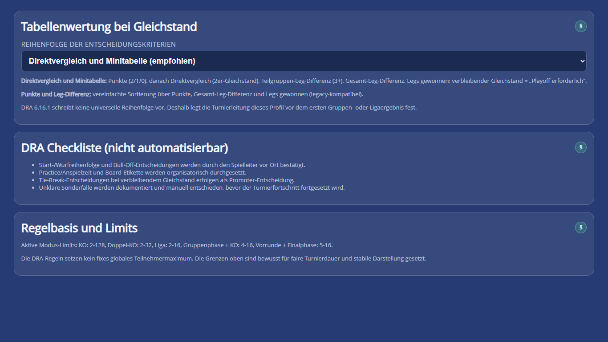

# Handbuch für Turnierleitungen

Dieses Dokument beschreibt Entscheidungen, die vor einem Turnier angekündigt und während des Ablaufs konsistent gehalten werden sollten. Die Oberfläche kennzeichnet, was technisch erzwungen wird und was eine organisatorische Entscheidung bleibt.

Für die reine Erstbedienung genügt der [Einsteigerleitfaden](einstieg.md). Fachbegriffe stehen im [Glossar](begriffe.md).

## Checkliste vor der Ausschreibung

- Modus und Teilnehmergrenzen festlegen.
- Matchdistanz und X01-Regeln je Phase veröffentlichen.
- Auslosung oder Setzreihenfolge festlegen.
- Freilosbehandlung und Zeitpunkt des Draw-Locks klären.
- Tabellenpunkte und Tie-Break-Reihenfolge bekannt geben.
- Qualifikationszahl und Finalphasentyp bei mehrphasigen Formaten festlegen.
- Anwurf/Bull-off, Practice, Pausen und Board-Etikette organisatorisch regeln.
- Genügend Zeitpuffer und eine Sicherungsstrategie vorsehen.

## Formatvorlagen und Spielregeln

Eine Formatvorlage setzt Modus, Best-of-Distanz und X01-Werte gemeinsam. Nach einer manuellen Änderung wird die Auswahl als `Individuell / Manuell` gekennzeichnet; damit ist sichtbar, dass keine automatische Profilkonformität mehr behauptet wird.

### Lokaler Spieleabend – 501 / Best of 5

- KO
- 501, Straight In, Double Out
- Best of 5 / First to 3
- Bull 25/50, Bull-off Normal
- private Lobby, technisches Maximum 50 Runden

Das ist die empfohlene Einstiegsvorlage des Produkts. Sie ist kompakt und erhält zugleich die technische ID älterer Best-of-5-Daten. Sie ist **kein offizielles PDC-Eventformat**.

### PDC European Tour – Runden 1 bis 4

- KO
- 501, Straight In, Double Out
- Best of 11 / First to 6
- Bull 25/50, Bull-off Normal

Der offizielle Formatanspruch gilt ausschließlich für die ersten vier Runden bis einschließlich Viertelfinale des dokumentierten European-Tour-Formats. Halbfinale und Finale verwenden längere Distanzen und werden von dieser Einzelvorlage nicht abgebildet. `Bull-off Normal` und `Max Runden 50` sind technische AutoDarts-Werte und keine PDC-Fachregeln.

### Individuell / Manuell

Geeignet für Hausregeln und veröffentlichte Veranstaltungsformate. Die Turnierleitung muss selbst prüfen, ob Startwert, In-/Out-Modus, Matchdistanz und Phasenformat der Ausschreibung entsprechen.

## Modusentscheidung

| Modus | Teilnehmer | Fachliche Wirkung | Typischer Einsatz |
|---|---:|---|---|
| KO | 2–128 | eine Niederlage; genau ein Champion-Pfad | kurze offene Turniere |
| Doppel-KO | 2–32 | Winners/Losers Bracket; Grand-Final-Regel erforderlich | zweite Chance bei begrenztem Feld |
| Liga | 2–16 | vollständiges Round Robin | kleiner, genauer Leistungsvergleich |
| Gruppen + KO | 4–16 | zwei Round-Robin-Gruppen; Top 2 in Kreuz-KO | garantierte Gruppenspiele plus Finale |
| Vorrunde + Finalphase | 5–16 | gleiche reale Vorrundenmatchzahl; Qualifikation in KO/Doppel-KO | planbares, eigenes Veranstalterformat |

Bei `groups_ko` ist eine gerade Teilnehmerzahl der sichere Produktstandard. Ungleiche Gruppengrößen sind nur nach ausdrücklicher Bestätigung der Turnierleitung zulässig. Der Assistant behauptet dabei keine universelle Verbandsregel.

Bei `preliminary_final` werden genau zwei Legs pro Vorrundenmatch gespielt; `1:1` ist möglich. Mangels exakter API-Abbildung bleibt dieser Teil manuell. Ein ungeklärter Gleichstand am Qualifikations-Cutoff blockiert die Finalphase, bis eine begründete Entscheidung dokumentiert wurde.

## Auslosung, Setzung und Draw-Lock

`KO-Erstrunde zufällig auslosen` aktiviert einen Open Draw. Bei deaktivierter Option bestimmt die Reihenfolge der Teilnehmerliste die Setzpositionen. Das Ergebnis wird gespeichert, sodass die Zuordnung nachvollziehbar bleibt.

Der Draw-Lock ist für neue KO- und Doppel-KO-Turniere standardmäßig aktiv. Er schützt den initialen Turnierbaum entsprechend DRA 6.12.1. Ein Entsperren ist nur als bewusste, bestätigte Entscheidung der Turnierleitung vorgesehen. Freilose sind explizite abgeschlossene Bye-Matches und benötigen keine Lobby.

## Tabellenwertung und Tie-Break

Die DRA-Regel 6.16.1 überlässt die konkrete Reihenfolge dem Veranstalter. Deshalb muss das Profil vor dem ersten relevanten Ergebnis feststehen.

### Direktvergleich und Minitabelle – empfohlen

1. Punkte
2. Direktvergleich bei genau zwei Punktgleichen
3. Teilgruppen-Leg-Differenz bei drei oder mehr Punktgleichen
4. Gesamt-Leg-Differenz
5. gewonnene Legs
6. weiterhin gleich: `Playoff erforderlich`

### Punkte und Leg-Differenz – vereinfacht

1. Punkte
2. Gesamt-Leg-Differenz
3. gewonnene Legs
4. weiterhin gleich: `Playoff erforderlich`

Nach dem ersten abgeschlossenen Gruppen- oder Ligaergebnis ist der Profilwechsel gesperrt. Verbleibende Gleichstände werden nicht zufällig aufgelöst.

_Die Oberfläche trennt die vom Veranstalter festzulegende Tie-Break-Reihenfolge von der nicht automatisierbaren DRA-Checkliste und den technischen Produktlimits._

## Einstellungen und Automatik

### AutoDarts-Automatik für Matchstart und Ergebnis

Standard ist AUS. Das vermeidet scheinbare Fehler für Turniere, die Ergebnisse bewusst manuell führen.

Bei Aktivierung werden benötigt:

- eine gültige AutoDarts-Sitzung mit erkanntem Auth-Token,
- eine gültige Board-ID,
- eindeutige Teilnehmernamen,
- eine spielbare Paarung,
- kein zweites gleichzeitig aktives API-Match.

Die Integration ist best effort. Mehrdeutige Zuordnungen, ungültige Ergebnisse oder unklare Statistikdaten werden nicht still übernommen. Die manuelle Leg-Erfassung bleibt als Fallback erhalten. Technische Details stehen in [AutoDarts API Capabilities](autodarts-api-capabilities.md).

_Die API-Automatik ist standardmäßig aus. Die beiden folgenden Schalter steuern neue Auslosungen und den Draw-Lock, nicht den API-Zugriff._

### Standard-Auslosung und Draw-Lock

Die beiden Standards gelten für neu erzeugte Turniere. Das aktive Turnier speichert seinen eigenen Draw- und Lock-Zustand; spätere Standardänderungen schreiben bestehende Turniere nicht still um.

### Erweiterte Diagnose

`Erweitert: Diagnose, Debug und Speicher` ist nur bei technischen Problemen nötig. Das Matchstart-Protokoll erfasst Vorprüfung, Payload, API-Schritte und Fehler, aber keine Auth-Tokens. Vor dem Teilen trotzdem Namen und Lobby-IDs prüfen.

## Zeitplanung

Die Prognose berechnet Matchplan, Abhängigkeitswellen, Distanz und X01-Setup. Die Boardanzahl begrenzt nur die rechnerisch gleichzeitig spielbaren Matches. Sie ist keine Boardverwaltung.

- `Schnell`: kurze Wechsel und zügige Spiele
- `Normal`: ausgewogener Standard
- `Langsam`: konservativer Puffer für Pausen und gemischte Felder

Die Schätzung ist ein Planungswert. Vor-Ort-Verzögerungen, Boardprobleme, Practice oder organisatorische Pausen bleiben außerhalb der Berechnung. Details: [Turnierdauer](tournament-duration.md).

## Sicherung und Wiederherstellung

Vor Veranstaltungsbeginn und nach wichtigen Phasen eine Sicherungsdatei herunterladen. Sie enthält das aktuelle Turnier mit Paarungen, Ergebnissen und Fortschritt.

Beim Wiederherstellen zeigt der Assistant Name, Modus und Teilnehmerzahl. Ein aktives Turnier wird erst nach Bestätigung ersetzt. Der JSON-Textimport liegt absichtlich im erweiterten Bereich; für den normalen Ablauf ist die Datei vorzuziehen. Mehrbrowser- oder Mehrgeräte-Synchronisierung ist nicht implementiert.

_Für den Veranstaltungsbetrieb ist die heruntergeladene Datei der einfachste Wiederherstellungsweg; der Textimport bleibt eine erweiterte Option._

## DRA-Checkliste vor Ort

Die folgenden Punkte sind `assisted` oder nicht verlässlich automatisierbar:

- Anwurf- und Wurfreihenfolge bestätigen,
- Practice/Anspielzeit und Board-Etikette durchsetzen,
- lokale Abweichungen und Sonderentscheidungen dokumentieren,
- verbliebene Tie-Breaks beziehungsweise Playoffs entscheiden,
- nur Matchformate verwenden, die zur veröffentlichten Turnierordnung passen.

Verbindliche Detailzuordnung: [DRA-Regeln in der GUI](dra-regeln-gui.md), [PDC-/DRA-Compliance](pdc-dra-compliance.md), [Compliance-Matrix](dra-compliance-matrix.md), [DRA Rulebook 2026](DRA-RULE_BOOK.pdf).

## Betriebscheck am Turniertag

1. Browser und AutoDarts-Sitzung aktualisieren.
2. Format, Teilnehmer und Zeitprognose gegen die Ausschreibung prüfen.
3. Eine Sicherungsdatei herunterladen.
4. Bei Automatik einen Test-Matchstart mit korrektem Board prüfen.
5. Manuelle Ergebnisführung als Fallback bereithalten.
6. Nach Gruppen-/Vorrundenende Tabellen und offene Tie-Breaks kontrollieren.
7. Vor der Finalphase erneut sichern.
